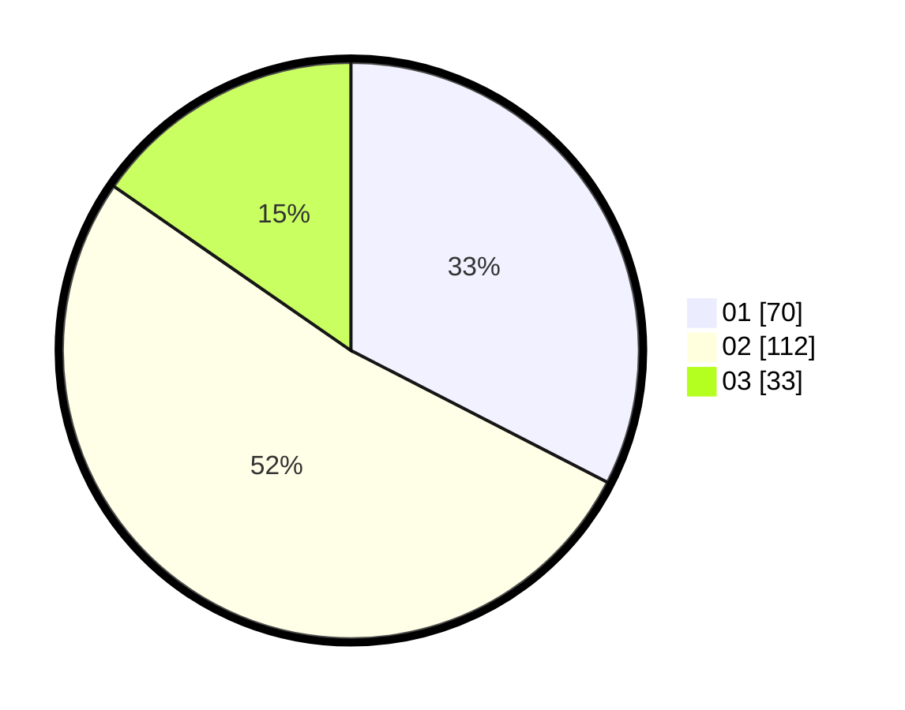

# Hasil

Hasil perolehan suara paslon dapat dilihat pada file paslon-01.txt, paslon-02.txt, dan paslon-03.txt.

Jika tidak ada, artinya data tersebut belum ada pada SIREKAP.

## Perolehan Suara

 * Paslon 01: **70**.
 * Paslon 02: **112**.
 * Paslon 03: **33**.

## Foto C Plano

https://sirekap-obj-formc.kpu.go.id/1346/pemilu/ppwp/31/74/05/10/04/3174051004041-20240215-231122--9fd32af9-cacd-4c9b-92ae-612f91c55725.jpg

https://sirekap-obj-formc.kpu.go.id/1346/pemilu/ppwp/31/74/05/10/04/3174051004041-20240215-231125--c1bda321-95c0-4dda-ac1d-ea0c271e822b.jpg

https://sirekap-obj-formc.kpu.go.id/1346/pemilu/ppwp/31/74/05/10/04/3174051004041-20240215-231123--55c92b56-c6a2-4ed6-9077-95f11f19c7d4.jpg

## DATA PEMILIH TETAP

Jumlah pemilih dalam DPT: **285**.
 * L: **145**.
 * P: **140**.

## DATA PENGGUNA HAK PILIH

Jumlah pengguna hak pilih dalam DPT: **216**.
 * L: **108**.
 * P: **108**.

Jumlah pengguna hak pilih dalam DPTb: **1**.
 * L: **1**.
 * P: **0**.

Jumlah pengguna hak pilih dalam DPK: **0**.
 * L: **0**.
 * P: **0**.

Jumlah pengguna hak pilih: **217**.
 * L: **109**.
 * P: **108**.

## JUMLAH SUARA SAH DAN TIDAK SAH

JUMLAH SELURUH SUARA SAH: **215**.

JUMLAH SUARA TIDAK SAH: **2**.

JUMLAH SELURUH SUARA SAH DAN SUARA TIDAK SAH: **217**.
