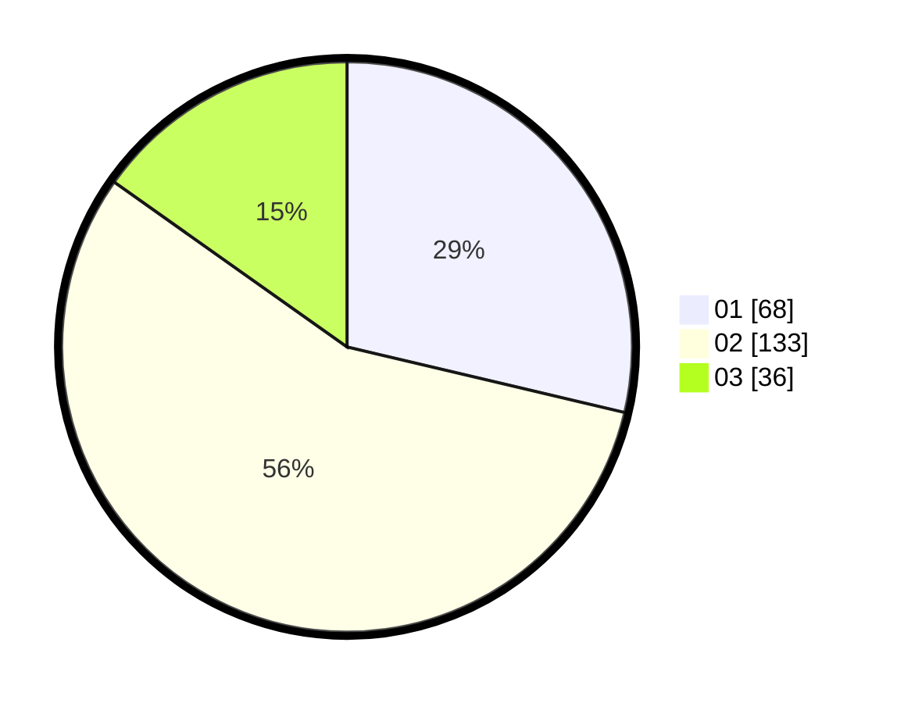

# Hasil

Hasil perolehan suara paslon dapat dilihat pada file paslon-01.txt, paslon-02.txt, dan paslon-03.txt.

Jika tidak ada, artinya data tersebut belum ada pada SIREKAP.

## Perolehan Suara

 * Paslon 01: **68**.
 * Paslon 02: **133**.
 * Paslon 03: **36**.

## Foto C Plano

https://sirekap-obj-formc.kpu.go.id/abad/pemilu/ppwp/31/74/05/10/04/3174051004043-20240215-022308--ed8cd964-6d0c-4fb6-a250-398197d8ea3c.jpg

https://sirekap-obj-formc.kpu.go.id/abad/pemilu/ppwp/31/74/05/10/04/3174051004043-20240215-022333--2062dfa5-aff0-4d75-a717-9627cd34503a.jpg

https://sirekap-obj-formc.kpu.go.id/abad/pemilu/ppwp/31/74/05/10/04/3174051004043-20240215-022319--c1a5323f-23ce-4480-ac15-c9d648f486d7.jpg

## DATA PEMILIH TETAP

Jumlah pemilih dalam DPT: **281**.
 * L: **143**.
 * P: **138**.

## DATA PENGGUNA HAK PILIH

Jumlah pengguna hak pilih dalam DPT: **281**.
 * L: **143**.
 * P: **138**.

Jumlah pengguna hak pilih dalam DPTb: **0**.
 * L: **0**.
 * P: **0**.

Jumlah pengguna hak pilih dalam DPK: **0**.
 * L: **0**.
 * P: **0**.

Jumlah pengguna hak pilih: **281**.
 * L: **143**.
 * P: **138**.

## JUMLAH SUARA SAH DAN TIDAK SAH

JUMLAH SELURUH SUARA SAH: **237**.

JUMLAH SUARA TIDAK SAH: **4**.

JUMLAH SELURUH SUARA SAH DAN SUARA TIDAK SAH: **241**.
