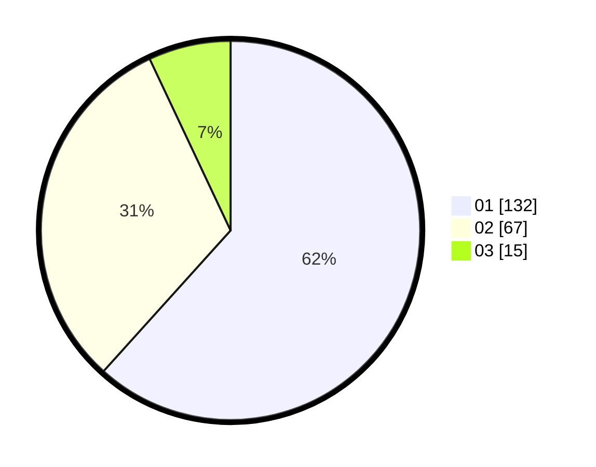

# Hasil

Hasil perolehan suara paslon dapat dilihat pada file paslon-01.txt, paslon-02.txt, dan paslon-03.txt.

Jika tidak ada, artinya data tersebut belum ada pada SIREKAP.

## Perolehan Suara

 * Paslon 01: **132**.
 * Paslon 02: **67**.
 * Paslon 03: **15**.

## Foto C Plano

https://sirekap-obj-formc.kpu.go.id/1dbb/pemilu/ppwp/31/74/05/10/04/3174051004058-20240214-185314--d7ef7c6b-b943-4e58-899a-f3758af2e5c8.jpg

https://sirekap-obj-formc.kpu.go.id/1dbb/pemilu/ppwp/31/74/05/10/04/3174051004058-20240214-185320--db8fb33a-90f2-482e-a58a-51277eaf0cda.jpg

https://sirekap-obj-formc.kpu.go.id/1dbb/pemilu/ppwp/31/74/05/10/04/3174051004058-20240214-185324--056a602f-a510-4df4-b059-4d3cc0c2b88d.jpg

## DATA PEMILIH TETAP

Jumlah pemilih dalam DPT: **210**.
 * L: **106**.
 * P: **104**.

## DATA PENGGUNA HAK PILIH

Jumlah pengguna hak pilih dalam DPT: **210**.
 * L: **106**.
 * P: **104**.

Jumlah pengguna hak pilih dalam DPTb: **4**.
 * L: **0**.
 * P: **4**.

Jumlah pengguna hak pilih dalam DPK: **3**.
 * L: **2**.
 * P: **1**.

Jumlah pengguna hak pilih: **217**.
 * L: **108**.
 * P: **109**.

## JUMLAH SUARA SAH DAN TIDAK SAH

JUMLAH SELURUH SUARA SAH: **214**.

JUMLAH SUARA TIDAK SAH: **3**.

JUMLAH SELURUH SUARA SAH DAN SUARA TIDAK SAH: **217**.
