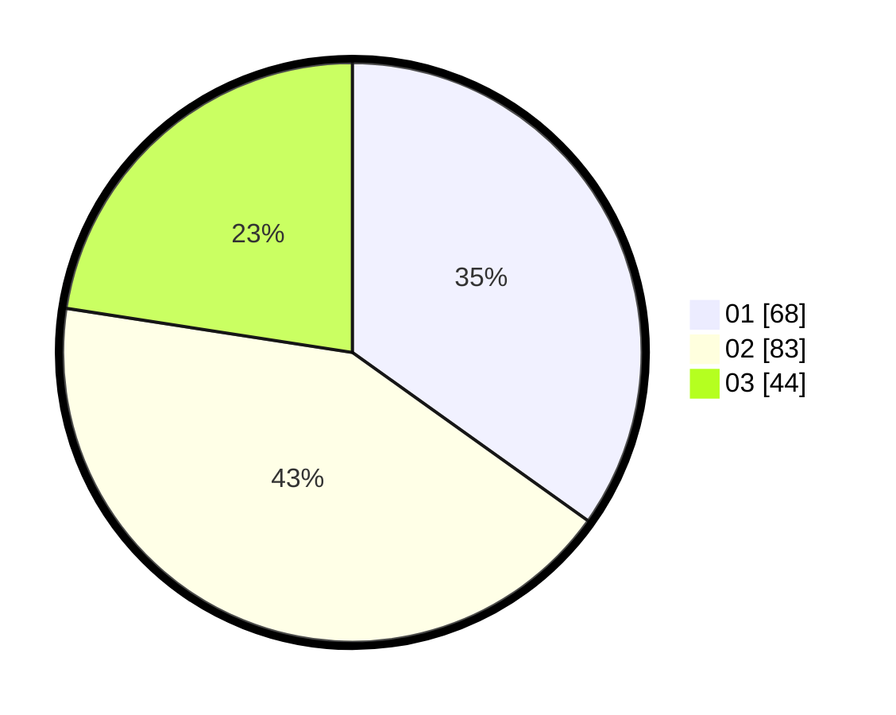

# Hasil

Hasil perolehan suara paslon dapat dilihat pada file paslon-01.txt, paslon-02.txt, dan paslon-03.txt.

Jika tidak ada, artinya data tersebut belum ada pada SIREKAP.

## Perolehan Suara

 * Paslon 01: **68**.
 * Paslon 02: **83**.
 * Paslon 03: **44**.

## Foto C Plano

https://sirekap-obj-formc.kpu.go.id/2df7/pemilu/ppwp/31/74/05/10/04/3174051004062-20240214-155510--67ae6469-83a9-4397-9349-7eb4206efdec.jpg

https://sirekap-obj-formc.kpu.go.id/2df7/pemilu/ppwp/31/74/05/10/04/3174051004062-20240214-155519--44e6e449-5c40-4d63-b3a8-2c73edfbf2b8.jpg

https://sirekap-obj-formc.kpu.go.id/2df7/pemilu/ppwp/31/74/05/10/04/3174051004062-20240214-155521--66127e1b-c2c8-41da-b264-f5dd6557117d.jpg

## DATA PEMILIH TETAP

Jumlah pemilih dalam DPT: **264**.
 * L: **128**.
 * P: **136**.

## DATA PENGGUNA HAK PILIH

Jumlah pengguna hak pilih dalam DPT: **195**.
 * L: **95**.
 * P: **100**.

Jumlah pengguna hak pilih dalam DPTb: **2**.
 * L: **2**.
 * P: **0**.

Jumlah pengguna hak pilih dalam DPK: **0**.
 * L: **0**.
 * P: **0**.

Jumlah pengguna hak pilih: **197**.
 * L: **97**.
 * P: **100**.

## JUMLAH SUARA SAH DAN TIDAK SAH

JUMLAH SELURUH SUARA SAH: **195**.

JUMLAH SUARA TIDAK SAH: **2**.

JUMLAH SELURUH SUARA SAH DAN SUARA TIDAK SAH: **197**.
