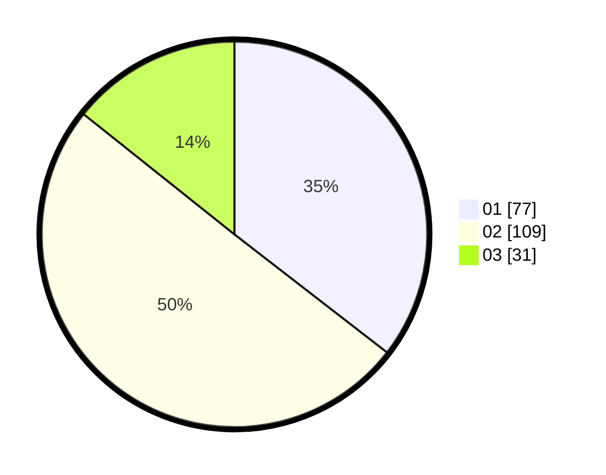

# Hasil

Hasil perolehan suara paslon dapat dilihat pada file paslon-01.txt, paslon-02.txt, dan paslon-03.txt.

Jika tidak ada, artinya data tersebut belum ada pada SIREKAP.

## Perolehan Suara

 * Paslon 01: **77**.
 * Paslon 02: **109**.
 * Paslon 03: **31**.

## Foto C Plano

https://sirekap-obj-formc.kpu.go.id/3156/pemilu/ppwp/31/74/05/10/04/3174051004069-20240216-142930--9fdbd083-4ca1-4be7-97c6-d4c87a893bd7.jpg

https://sirekap-obj-formc.kpu.go.id/3156/pemilu/ppwp/31/74/05/10/04/3174051004069-20240216-142932--6e83b5f8-ee24-4036-bbc6-9a32babcd56b.jpg

https://sirekap-obj-formc.kpu.go.id/3156/pemilu/ppwp/31/74/05/10/04/3174051004069-20240216-142931--32bd8ce1-5b49-4401-8dc4-8be9a9e4875a.jpg

## DATA PEMILIH TETAP

Jumlah pemilih dalam DPT: **257**.
 * L: **134**.
 * P: **123**.

## DATA PENGGUNA HAK PILIH

Jumlah pengguna hak pilih dalam DPT: **220**.
 * L: **108**.
 * P: **112**.

Jumlah pengguna hak pilih dalam DPTb: **0**.
 * L: **0**.
 * P: **0**.

Jumlah pengguna hak pilih dalam DPK: **2**.
 * L: **1**.
 * P: **1**.

Jumlah pengguna hak pilih: **222**.
 * L: **109**.
 * P: **113**.

## JUMLAH SUARA SAH DAN TIDAK SAH

JUMLAH SELURUH SUARA SAH: **217**.

JUMLAH SUARA TIDAK SAH: **5**.

JUMLAH SELURUH SUARA SAH DAN SUARA TIDAK SAH: **222**.
