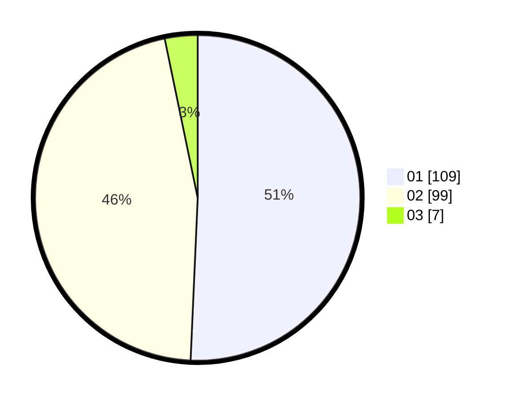

# Hasil

Hasil perolehan suara paslon dapat dilihat pada file paslon-01.txt, paslon-02.txt, dan paslon-03.txt.

Jika tidak ada, artinya data tersebut belum ada pada SIREKAP.

## Perolehan Suara

 * Paslon 01: **109**.
 * Paslon 02: **99**.
 * Paslon 03: **7**.

## Foto C Plano

https://sirekap-obj-formc.kpu.go.id/f9ad/pemilu/ppwp/31/74/05/10/04/3174051004071-20240215-204542--9d27bce8-cb30-46ca-923f-3869e932b141.jpg

https://sirekap-obj-formc.kpu.go.id/f9ad/pemilu/ppwp/31/74/05/10/04/3174051004071-20240215-204544--ef3209ae-ac9c-4c39-ba00-8c02626f4e2f.jpg

https://sirekap-obj-formc.kpu.go.id/f9ad/pemilu/ppwp/31/74/05/10/04/3174051004071-20240215-204543--c0b951b6-79da-4b6f-87b4-5d8ec4a8d65e.jpg

## DATA PEMILIH TETAP

Jumlah pemilih dalam DPT: **266**.
 * L: **138**.
 * P: **128**.

## DATA PENGGUNA HAK PILIH

Jumlah pengguna hak pilih dalam DPT: **218**.
 * L: **108**.
 * P: **110**.

Jumlah pengguna hak pilih dalam DPTb: **0**.
 * L: **0**.
 * P: **0**.

Jumlah pengguna hak pilih dalam DPK: **2**.
 * L: **1**.
 * P: **1**.

Jumlah pengguna hak pilih: **220**.
 * L: **109**.
 * P: **111**.

## JUMLAH SUARA SAH DAN TIDAK SAH

JUMLAH SELURUH SUARA SAH: **215**.

JUMLAH SUARA TIDAK SAH: **5**.

JUMLAH SELURUH SUARA SAH DAN SUARA TIDAK SAH: **220**.
