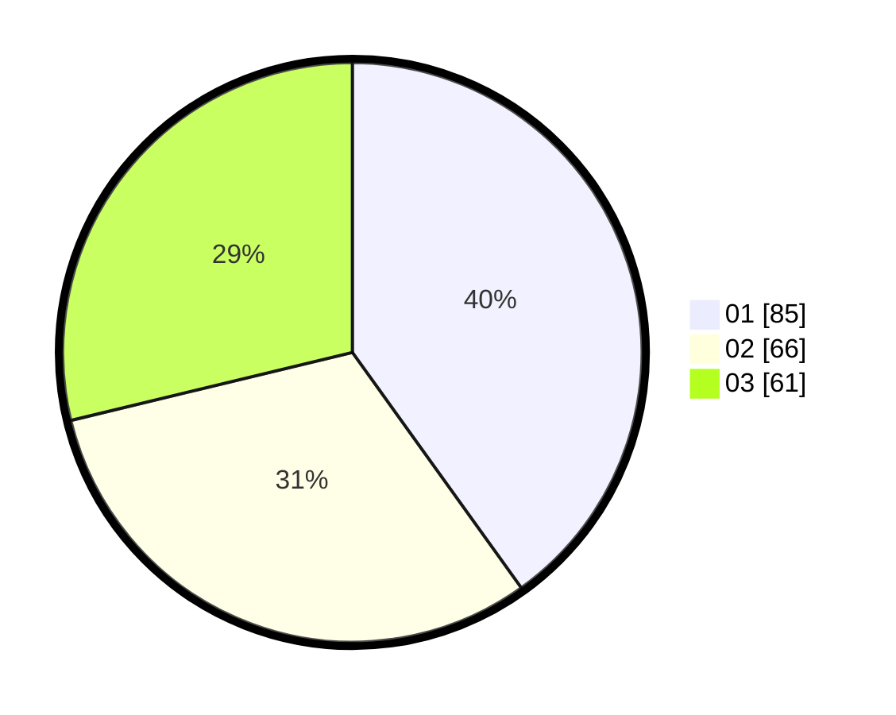

# Hasil

Hasil perolehan suara paslon dapat dilihat pada file paslon-01.txt, paslon-02.txt, dan paslon-03.txt.

Jika tidak ada, artinya data tersebut belum ada pada SIREKAP.

## Perolehan Suara

 * Paslon 01: **85**.
 * Paslon 02: **66**.
 * Paslon 03: **61**.

## Foto C Plano

https://sirekap-obj-formc.kpu.go.id/bee7/pemilu/ppwp/31/74/05/10/04/3174051004072-20240215-222018--6e711d1b-4dc4-4243-8a13-93e26f2e8295.jpg

https://sirekap-obj-formc.kpu.go.id/bee7/pemilu/ppwp/31/74/05/10/04/3174051004072-20240215-222019--12120fde-07b3-4645-91e7-8060cc69e936.jpg

https://sirekap-obj-formc.kpu.go.id/bee7/pemilu/ppwp/31/74/05/10/04/3174051004072-20240215-222018--86c0045c-90d9-432a-a686-e218ff631f6a.jpg

## DATA PEMILIH TETAP

Jumlah pemilih dalam DPT: **269**.
 * L: **132**.
 * P: **137**.

## DATA PENGGUNA HAK PILIH

Jumlah pengguna hak pilih dalam DPT: **208**.
 * L: **104**.
 * P: **104**.

Jumlah pengguna hak pilih dalam DPTb: **5**.
 * L: **1**.
 * P: **4**.

Jumlah pengguna hak pilih dalam DPK: **3**.
 * L: **3**.
 * P: **0**.

Jumlah pengguna hak pilih: **216**.
 * L: **108**.
 * P: **108**.

## JUMLAH SUARA SAH DAN TIDAK SAH

JUMLAH SELURUH SUARA SAH: **212**.

JUMLAH SUARA TIDAK SAH: **4**.

JUMLAH SELURUH SUARA SAH DAN SUARA TIDAK SAH: **216**.
