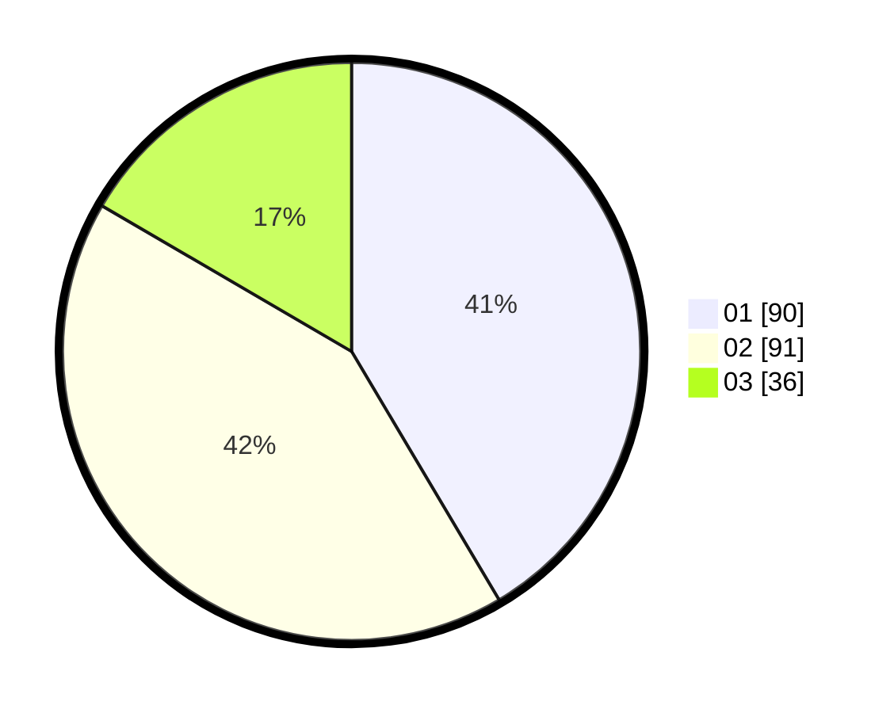

# Hasil

Hasil perolehan suara paslon dapat dilihat pada file paslon-01.txt, paslon-02.txt, dan paslon-03.txt.

Jika tidak ada, artinya data tersebut belum ada pada SIREKAP.

## Perolehan Suara

 * Paslon 01: **90**.
 * Paslon 02: **91**.
 * Paslon 03: **36**.

## Foto C Plano

https://sirekap-obj-formc.kpu.go.id/3860/pemilu/ppwp/31/74/05/10/04/3174051004084-20240216-131833--54efd4c7-db7f-4df9-8262-c768334795ed.jpg

https://sirekap-obj-formc.kpu.go.id/3860/pemilu/ppwp/31/74/05/10/04/3174051004084-20240216-131834--dee06d3f-a5b5-4223-b416-6eb95e884495.jpg

https://sirekap-obj-formc.kpu.go.id/3860/pemilu/ppwp/31/74/05/10/04/3174051004084-20240216-131833--5d46ea65-4640-4620-b840-18f3aa6d6fb7.jpg

## DATA PEMILIH TETAP

Jumlah pemilih dalam DPT: **258**.
 * L: **132**.
 * P: **126**.

## DATA PENGGUNA HAK PILIH

Jumlah pengguna hak pilih dalam DPT: **214**.
 * L: **112**.
 * P: **102**.

Jumlah pengguna hak pilih dalam DPTb: **6**.
 * L: **0**.
 * P: **6**.

Jumlah pengguna hak pilih dalam DPK: **1**.
 * L: **1**.
 * P: **0**.

Jumlah pengguna hak pilih: **221**.
 * L: **113**.
 * P: **108**.

## JUMLAH SUARA SAH DAN TIDAK SAH

JUMLAH SELURUH SUARA SAH: **217**.

JUMLAH SUARA TIDAK SAH: **4**.

JUMLAH SELURUH SUARA SAH DAN SUARA TIDAK SAH: **221**.
