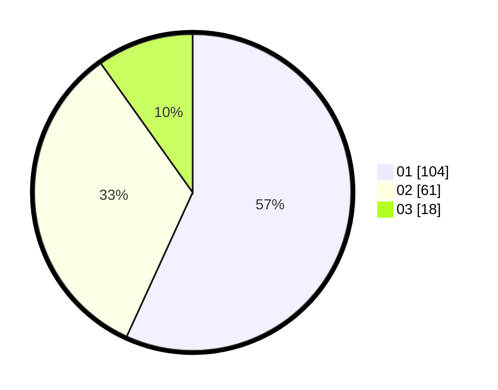

# Hasil

Hasil perolehan suara paslon dapat dilihat pada file paslon-01.txt, paslon-02.txt, dan paslon-03.txt.

Jika tidak ada, artinya data tersebut belum ada pada SIREKAP.

## Perolehan Suara

 * Paslon 01: **104**.
 * Paslon 02: **61**.
 * Paslon 03: **18**.

## Foto C Plano

https://sirekap-obj-formc.kpu.go.id/fb2c/pemilu/ppwp/31/74/05/10/04/3174051004096-20240214-162710--1745f1db-1871-4ff9-a7e0-06c6d202a3d7.jpg

https://sirekap-obj-formc.kpu.go.id/fb2c/pemilu/ppwp/31/74/05/10/04/3174051004096-20240214-163418--34cdad1a-6f6d-4b37-a1ca-cf752d05096e.jpg

https://sirekap-obj-formc.kpu.go.id/fb2c/pemilu/ppwp/31/74/05/10/04/3174051004096-20240214-163537--e449d309-8d3d-4a6c-b192-ed33eb62fa86.jpg

## DATA PEMILIH TETAP

Jumlah pemilih dalam DPT: **282**.
 * L: **144**.
 * P: **138**.

## DATA PENGGUNA HAK PILIH

Jumlah pengguna hak pilih dalam DPT: **183**.
 * L: **93**.
 * P: **90**.

Jumlah pengguna hak pilih dalam DPTb: **0**.
 * L: **0**.
 * P: **0**.

Jumlah pengguna hak pilih dalam DPK: **0**.
 * L: **0**.
 * P: **0**.

Jumlah pengguna hak pilih: **183**.
 * L: **93**.
 * P: **90**.

## JUMLAH SUARA SAH DAN TIDAK SAH

JUMLAH SELURUH SUARA SAH: **183**.

JUMLAH SUARA TIDAK SAH: **0**.

JUMLAH SELURUH SUARA SAH DAN SUARA TIDAK SAH: **183**.
