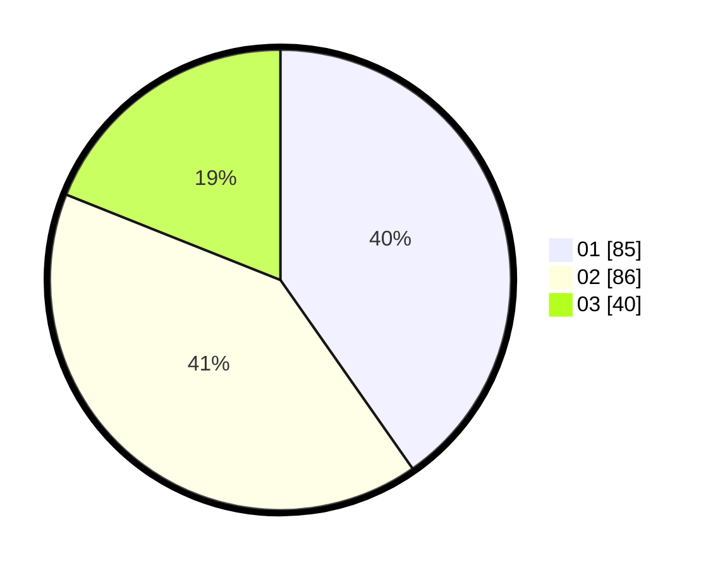

# Hasil

Hasil perolehan suara paslon dapat dilihat pada file paslon-01.txt, paslon-02.txt, dan paslon-03.txt.

Jika tidak ada, artinya data tersebut belum ada pada SIREKAP.

## Perolehan Suara

 * Paslon 01: **85**.
 * Paslon 02: **86**.
 * Paslon 03: **40**.

## Foto C Plano

https://sirekap-obj-formc.kpu.go.id/befe/pemilu/ppwp/31/74/05/10/04/3174051004097-20240216-134456--ea8c6f77-2e2c-49aa-8da4-ba56be395896.jpg

https://sirekap-obj-formc.kpu.go.id/befe/pemilu/ppwp/31/74/05/10/04/3174051004097-20240216-134457--eae3fe88-a035-4af2-8dbe-b298af57bc8d.jpg

https://sirekap-obj-formc.kpu.go.id/befe/pemilu/ppwp/31/74/05/10/04/3174051004097-20240216-134457--02f55dad-beed-4481-a7f1-b7ea83289556.jpg

## DATA PEMILIH TETAP

Jumlah pemilih dalam DPT: **280**.
 * L: **133**.
 * P: **147**.

## DATA PENGGUNA HAK PILIH

Jumlah pengguna hak pilih dalam DPT: **215**.
 * L: **97**.
 * P: **118**.

Jumlah pengguna hak pilih dalam DPTb: **2**.
 * L: **2**.
 * P: **0**.

Jumlah pengguna hak pilih dalam DPK: **1**.
 * L: **1**.
 * P: **0**.

Jumlah pengguna hak pilih: **218**.
 * L: **100**.
 * P: **118**.

## JUMLAH SUARA SAH DAN TIDAK SAH

JUMLAH SELURUH SUARA SAH: **211**.

JUMLAH SUARA TIDAK SAH: **7**.

JUMLAH SELURUH SUARA SAH DAN SUARA TIDAK SAH: **218**.
