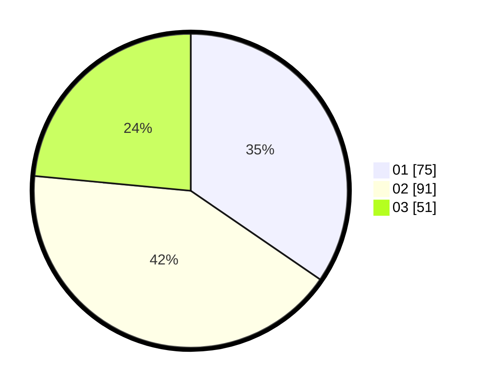

# Hasil

Hasil perolehan suara paslon dapat dilihat pada file paslon-01.txt, paslon-02.txt, dan paslon-03.txt.

Jika tidak ada, artinya data tersebut belum ada pada SIREKAP.

## Perolehan Suara

 * Paslon 01: **75**.
 * Paslon 02: **91**.
 * Paslon 03: **51**.

## Foto C Plano

https://sirekap-obj-formc.kpu.go.id/9bbc/pemilu/ppwp/31/74/05/10/04/3174051004098-20240215-032548--7a88ca45-b4c6-4d93-bf65-7d9116762e40.jpg

https://sirekap-obj-formc.kpu.go.id/9bbc/pemilu/ppwp/31/74/05/10/04/3174051004098-20240214-155013--50d1b919-ac88-469b-b631-a63573faa8f7.jpg

https://sirekap-obj-formc.kpu.go.id/9bbc/pemilu/ppwp/31/74/05/10/04/3174051004098-20240214-155318--327b2d6b-e939-4ecc-8d8c-f3271bdb69fd.jpg

## DATA PEMILIH TETAP

Jumlah pemilih dalam DPT: **279**.
 * L: **137**.
 * P: **142**.

## DATA PENGGUNA HAK PILIH

Jumlah pengguna hak pilih dalam DPT: **220**.
 * L: **110**.
 * P: **110**.

Jumlah pengguna hak pilih dalam DPTb: **1**.
 * L: **0**.
 * P: **1**.

Jumlah pengguna hak pilih dalam DPK: **0**.
 * L: **0**.
 * P: **0**.

Jumlah pengguna hak pilih: **221**.
 * L: **110**.
 * P: **111**.

## JUMLAH SUARA SAH DAN TIDAK SAH

JUMLAH SELURUH SUARA SAH: **217**.

JUMLAH SUARA TIDAK SAH: **4**.

JUMLAH SELURUH SUARA SAH DAN SUARA TIDAK SAH: **221**.
