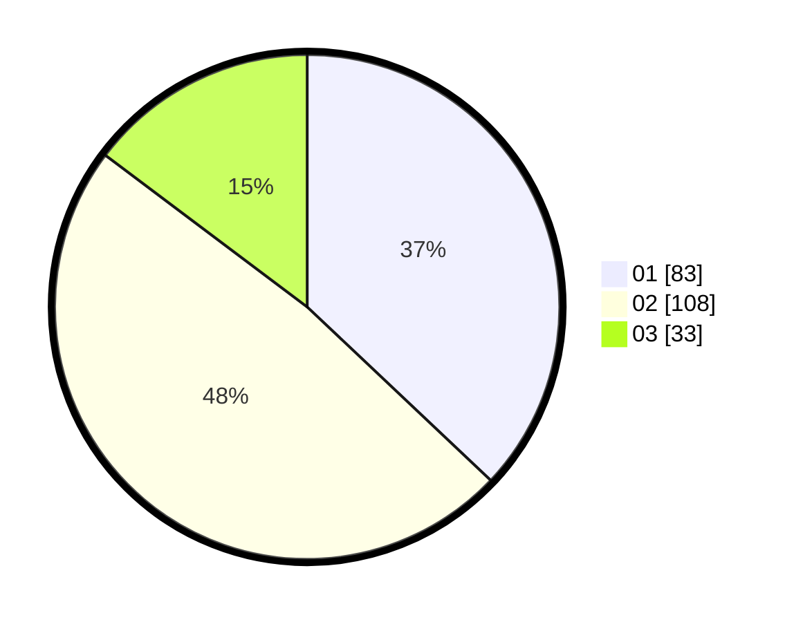

# Hasil

Hasil perolehan suara paslon dapat dilihat pada file paslon-01.txt, paslon-02.txt, dan paslon-03.txt.

Jika tidak ada, artinya data tersebut belum ada pada SIREKAP.

## Perolehan Suara

 * Paslon 01: **83**.
 * Paslon 02: **108**.
 * Paslon 03: **33**.

## Foto C Plano

https://sirekap-obj-formc.kpu.go.id/5c0b/pemilu/ppwp/31/74/05/10/04/3174051004105-20240215-225949--786a97e0-b998-4f89-9c3e-a620e0660184.jpg

https://sirekap-obj-formc.kpu.go.id/5c0b/pemilu/ppwp/31/74/05/10/04/3174051004105-20240215-225951--ba6cb517-b509-4e7b-b305-b650e4d0a154.jpg

https://sirekap-obj-formc.kpu.go.id/5c0b/pemilu/ppwp/31/74/05/10/04/3174051004105-20240215-225950--ea7c8f53-8292-440b-b90f-4380673043ee.jpg

## DATA PEMILIH TETAP

Jumlah pemilih dalam DPT: **290**.
 * L: **144**.
 * P: **146**.

## DATA PENGGUNA HAK PILIH

Jumlah pengguna hak pilih dalam DPT: **230**.
 * L: **106**.
 * P: **124**.

Jumlah pengguna hak pilih dalam DPTb: **3**.
 * L: **2**.
 * P: **1**.

Jumlah pengguna hak pilih dalam DPK: **0**.
 * L: **0**.
 * P: **0**.

Jumlah pengguna hak pilih: **233**.
 * L: **108**.
 * P: **125**.

## JUMLAH SUARA SAH DAN TIDAK SAH

JUMLAH SELURUH SUARA SAH: **224**.

JUMLAH SUARA TIDAK SAH: **9**.

JUMLAH SELURUH SUARA SAH DAN SUARA TIDAK SAH: **0**.
