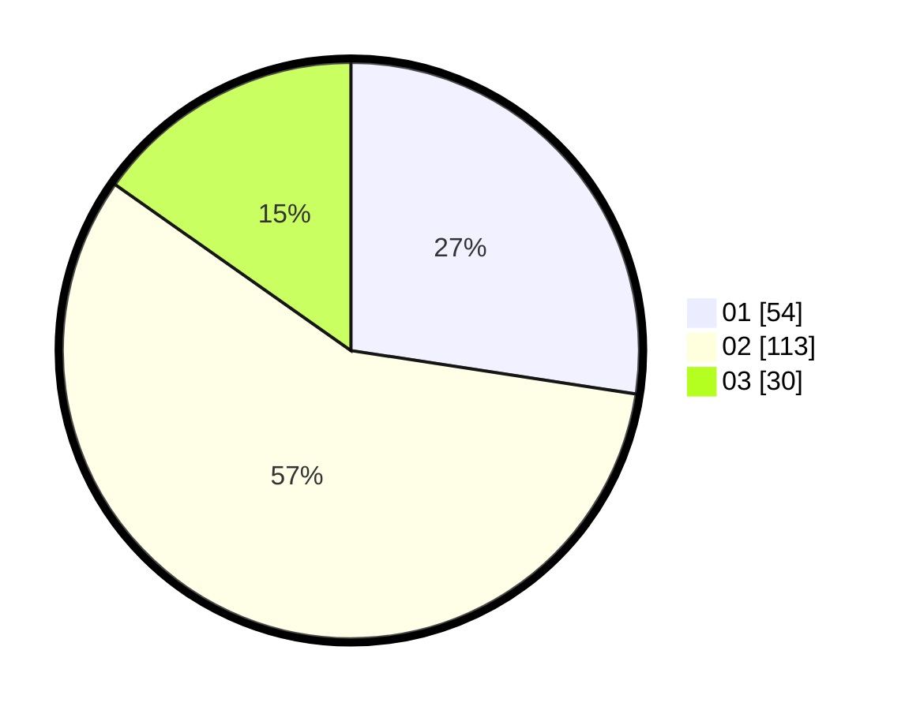

# Hasil

Hasil perolehan suara paslon dapat dilihat pada file paslon-01.txt, paslon-02.txt, dan paslon-03.txt.

Jika tidak ada, artinya data tersebut belum ada pada SIREKAP.

## Perolehan Suara

 * Paslon 01: **54**.
 * Paslon 02: **113**.
 * Paslon 03: **30**.

## Foto C Plano

https://sirekap-obj-formc.kpu.go.id/1cc0/pemilu/ppwp/31/74/05/10/04/3174051004122-20240214-191343--0d89aa65-48ca-4778-b9b7-d7b3a2a7bd61.jpg

https://sirekap-obj-formc.kpu.go.id/1cc0/pemilu/ppwp/31/74/05/10/04/3174051004122-20240214-191404--836232d4-7b43-4e13-b80d-c5c301f47f33.jpg

https://sirekap-obj-formc.kpu.go.id/1cc0/pemilu/ppwp/31/74/05/10/04/3174051004122-20240214-191354--af33964e-cf0b-4afd-96f9-72b8d59d65d0.jpg

## DATA PEMILIH TETAP

Jumlah pemilih dalam DPT: **277**.
 * L: **136**.
 * P: **141**.

## DATA PENGGUNA HAK PILIH

Jumlah pengguna hak pilih dalam DPT: **195**.
 * L: **89**.
 * P: **106**.

Jumlah pengguna hak pilih dalam DPTb: **3**.
 * L: **3**.
 * P: **0**.

Jumlah pengguna hak pilih dalam DPK: **0**.
 * L: **0**.
 * P: **0**.

Jumlah pengguna hak pilih: **198**.
 * L: **92**.
 * P: **106**.

## JUMLAH SUARA SAH DAN TIDAK SAH

JUMLAH SELURUH SUARA SAH: **197**.

JUMLAH SUARA TIDAK SAH: **1**.

JUMLAH SELURUH SUARA SAH DAN SUARA TIDAK SAH: **198**.
