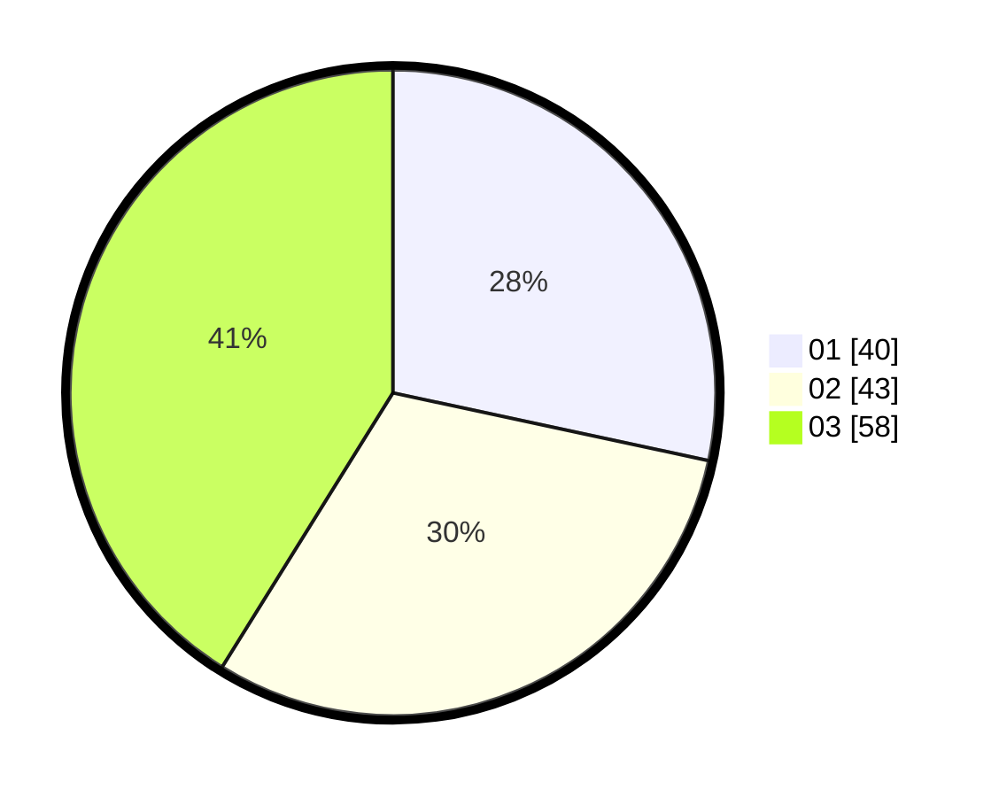

# Hasil

Hasil perolehan suara paslon dapat dilihat pada file paslon-01.txt, paslon-02.txt, dan paslon-03.txt.

Jika tidak ada, artinya data tersebut belum ada pada SIREKAP.

## Perolehan Suara

 * Paslon 01: **40**.
 * Paslon 02: **43**.
 * Paslon 03: **58**.

## Foto C Plano

https://sirekap-obj-formc.kpu.go.id/9157/pemilu/ppwp/31/74/05/10/04/3174051004130-20240216-072044--fb63b6c8-156f-4957-a7b0-0254feae6025.jpg

https://sirekap-obj-formc.kpu.go.id/9157/pemilu/ppwp/31/74/05/10/04/3174051004130-20240216-072046--eb4735aa-79d4-46d2-b3f0-223d8c971ad5.jpg

https://sirekap-obj-formc.kpu.go.id/9157/pemilu/ppwp/31/74/05/10/04/3174051004130-20240216-072045--54e4e350-2c18-4edf-a197-17f11c175d48.jpg

## DATA PEMILIH TETAP

Jumlah pemilih dalam DPT: **202**.
 * L: **101**.
 * P: **101**.

## DATA PENGGUNA HAK PILIH

Jumlah pengguna hak pilih dalam DPT: **131**.
 * L: **66**.
 * P: **65**.

Jumlah pengguna hak pilih dalam DPTb: **10**.
 * L: **1**.
 * P: **9**.

Jumlah pengguna hak pilih dalam DPK: **1**.
 * L: **0**.
 * P: **1**.

Jumlah pengguna hak pilih: **142**.
 * L: **67**.
 * P: **75**.

## JUMLAH SUARA SAH DAN TIDAK SAH

JUMLAH SELURUH SUARA SAH: **141**.

JUMLAH SUARA TIDAK SAH: **1**.

JUMLAH SELURUH SUARA SAH DAN SUARA TIDAK SAH: **142**.
