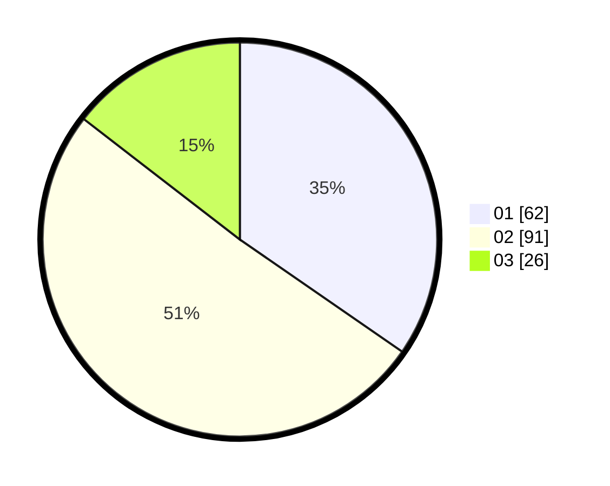

# Hasil

Hasil perolehan suara paslon dapat dilihat pada file paslon-01.txt, paslon-02.txt, dan paslon-03.txt.

Jika tidak ada, artinya data tersebut belum ada pada SIREKAP.

## Perolehan Suara

 * Paslon 01: **62**.
 * Paslon 02: **91**.
 * Paslon 03: **26**.

## Foto C Plano

https://sirekap-obj-formc.kpu.go.id/d52c/pemilu/ppwp/31/74/05/10/04/3174051004132-20240214-224312--df944acb-afde-4964-a14d-a8b4b283953e.jpg

https://sirekap-obj-formc.kpu.go.id/d52c/pemilu/ppwp/31/74/05/10/04/3174051004132-20240214-224625--6f46d156-beae-4829-87d9-afeb6f7297c6.jpg

https://sirekap-obj-formc.kpu.go.id/d52c/pemilu/ppwp/31/74/05/10/04/3174051004132-20240214-224902--e537d9fc-6d2a-409e-98f2-835fef4cd83c.jpg
