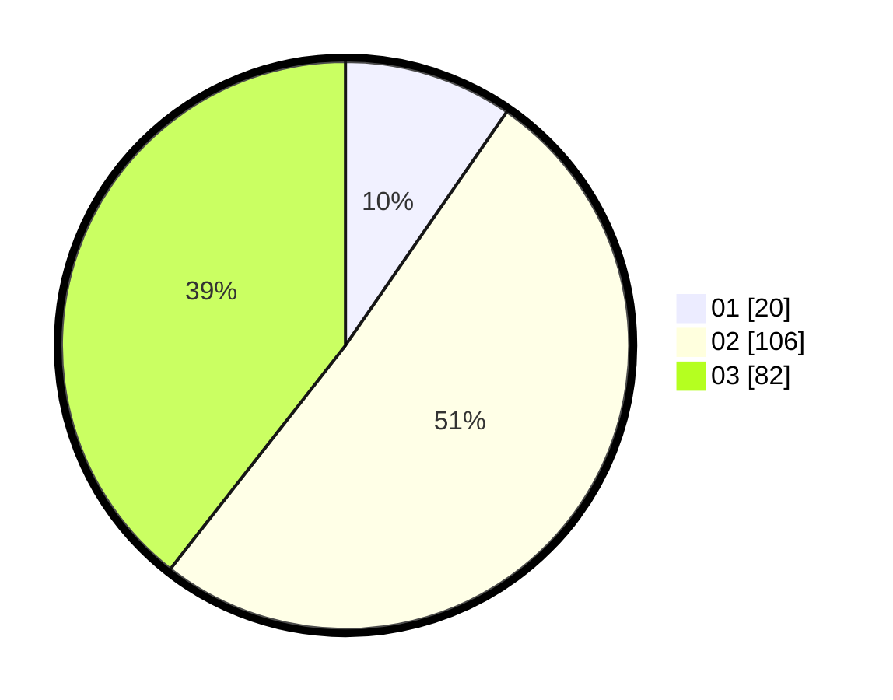

# Hasil

Hasil perolehan suara paslon dapat dilihat pada file paslon-01.txt, paslon-02.txt, dan paslon-03.txt.

Jika tidak ada, artinya data tersebut belum ada pada SIREKAP.

## Perolehan Suara

 * Paslon 01: **20**.
 * Paslon 02: **106**.
 * Paslon 03: **82**.

## Foto C Plano

https://sirekap-obj-formc.kpu.go.id/ef4c/pemilu/ppwp/31/74/05/10/04/3174051004134-20240216-182809--f0d7b338-2642-4edb-81ac-74f6a762bc04.jpg

https://sirekap-obj-formc.kpu.go.id/ef4c/pemilu/ppwp/31/74/05/10/04/3174051004134-20240216-181103--d887b21f-0b55-4b51-8b21-65f2b0ce963a.jpg

https://sirekap-obj-formc.kpu.go.id/ef4c/pemilu/ppwp/31/74/05/10/04/3174051004134-20240216-181151--ac802ed5-f66a-489f-a2a0-fd524163d50a.jpg

## DATA PEMILIH TETAP

Jumlah pemilih dalam DPT: **270**.
 * L: **120**.
 * P: **150**.

## DATA PENGGUNA HAK PILIH

Jumlah pengguna hak pilih dalam DPT: **198**.
 * L: **86**.
 * P: **112**.

Jumlah pengguna hak pilih dalam DPTb: **11**.
 * L: **4**.
 * P: **7**.

Jumlah pengguna hak pilih dalam DPK: **1**.
 * L: **0**.
 * P: **1**.

Jumlah pengguna hak pilih: **210**.
 * L: **90**.
 * P: **120**.

## JUMLAH SUARA SAH DAN TIDAK SAH

JUMLAH SELURUH SUARA SAH: **208**.

JUMLAH SUARA TIDAK SAH: **2**.

JUMLAH SELURUH SUARA SAH DAN SUARA TIDAK SAH: **210**.
