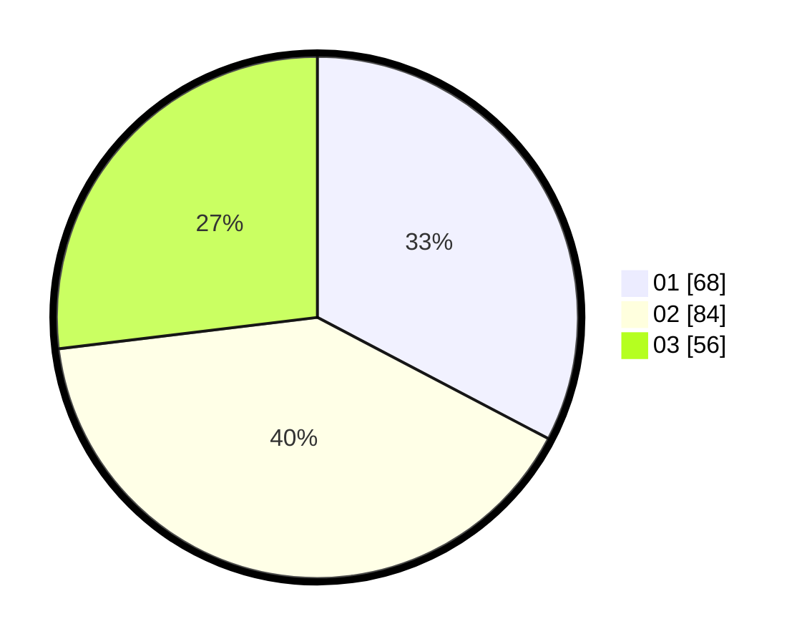

# Hasil

Hasil perolehan suara paslon dapat dilihat pada file paslon-01.txt, paslon-02.txt, dan paslon-03.txt.

Jika tidak ada, artinya data tersebut belum ada pada SIREKAP.

## Perolehan Suara

 * Paslon 01: **68**.
 * Paslon 02: **84**.
 * Paslon 03: **56**.

## Foto C Plano

https://sirekap-obj-formc.kpu.go.id/4c93/pemilu/ppwp/31/74/05/10/04/3174051004138-20240215-105707--d4f21071-d7d7-4824-a2b6-0528b7bbd507.jpg

https://sirekap-obj-formc.kpu.go.id/4c93/pemilu/ppwp/31/74/05/10/04/3174051004138-20240215-105728--7c4808e4-8d48-4332-9fca-b580d4d59cdb.jpg

https://sirekap-obj-formc.kpu.go.id/4c93/pemilu/ppwp/31/74/05/10/04/3174051004138-20240215-105718--de9415b4-c29b-43fb-b2fc-cd528994d85d.jpg

## DATA PEMILIH TETAP

Jumlah pemilih dalam DPT: **274**.
 * L: **142**.
 * P: **132**.

## DATA PENGGUNA HAK PILIH

Jumlah pengguna hak pilih dalam DPT: **203**.
 * L: **100**.
 * P: **103**.

Jumlah pengguna hak pilih dalam DPTb: **22**.
 * L: **8**.
 * P: **14**.

Jumlah pengguna hak pilih dalam DPK: **0**.
 * L: **0**.
 * P: **0**.

Jumlah pengguna hak pilih: **225**.
 * L: **108**.
 * P: **117**.

## JUMLAH SUARA SAH DAN TIDAK SAH

JUMLAH SELURUH SUARA SAH: **208**.

JUMLAH SUARA TIDAK SAH: **18**.

JUMLAH SELURUH SUARA SAH DAN SUARA TIDAK SAH: **226**.
