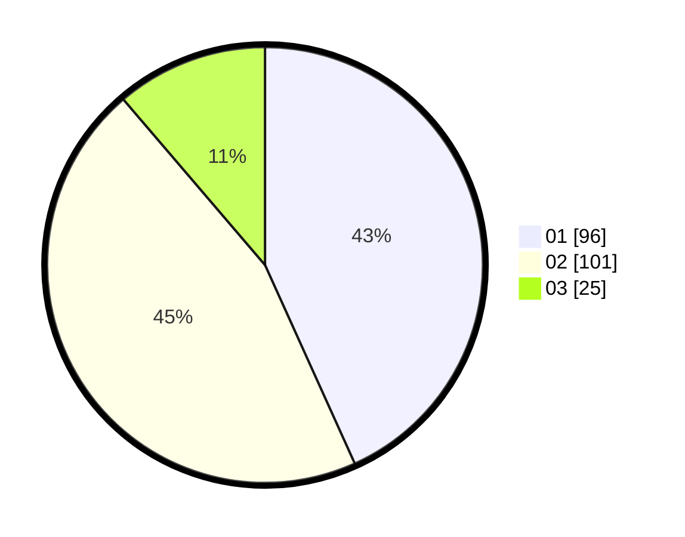

# Hasil

Hasil perolehan suara paslon dapat dilihat pada file paslon-01.txt, paslon-02.txt, dan paslon-03.txt.

Jika tidak ada, artinya data tersebut belum ada pada SIREKAP.

## Perolehan Suara

 * Paslon 01: **96**.
 * Paslon 02: **101**.
 * Paslon 03: **25**.

## Foto C Plano

https://sirekap-obj-formc.kpu.go.id/2213/pemilu/ppwp/31/74/05/10/04/3174051004139-20240216-020219--781c0c37-32d3-4127-b7f9-c99366714bca.jpg

https://sirekap-obj-formc.kpu.go.id/2213/pemilu/ppwp/31/74/05/10/04/3174051004139-20240216-020237--ec7733eb-efd3-4526-b984-6f5c54cdfe1e.jpg

https://sirekap-obj-formc.kpu.go.id/2213/pemilu/ppwp/31/74/05/10/04/3174051004139-20240216-020227--863f2506-760a-4574-856f-cf03f35556eb.jpg

## DATA PEMILIH TETAP

Jumlah pemilih dalam DPT: **266**.
 * L: **137**.
 * P: **129**.

## DATA PENGGUNA HAK PILIH

Jumlah pengguna hak pilih dalam DPT: **203**.
 * L: **103**.
 * P: **100**.

Jumlah pengguna hak pilih dalam DPTb: **19**.
 * L: **9**.
 * P: **10**.

Jumlah pengguna hak pilih dalam DPK: **7**.
 * L: **3**.
 * P: **4**.

Jumlah pengguna hak pilih: **229**.
 * L: **115**.
 * P: **114**.

## JUMLAH SUARA SAH DAN TIDAK SAH

JUMLAH SELURUH SUARA SAH: **222**.

JUMLAH SUARA TIDAK SAH: **7**.

JUMLAH SELURUH SUARA SAH DAN SUARA TIDAK SAH: **229**.
