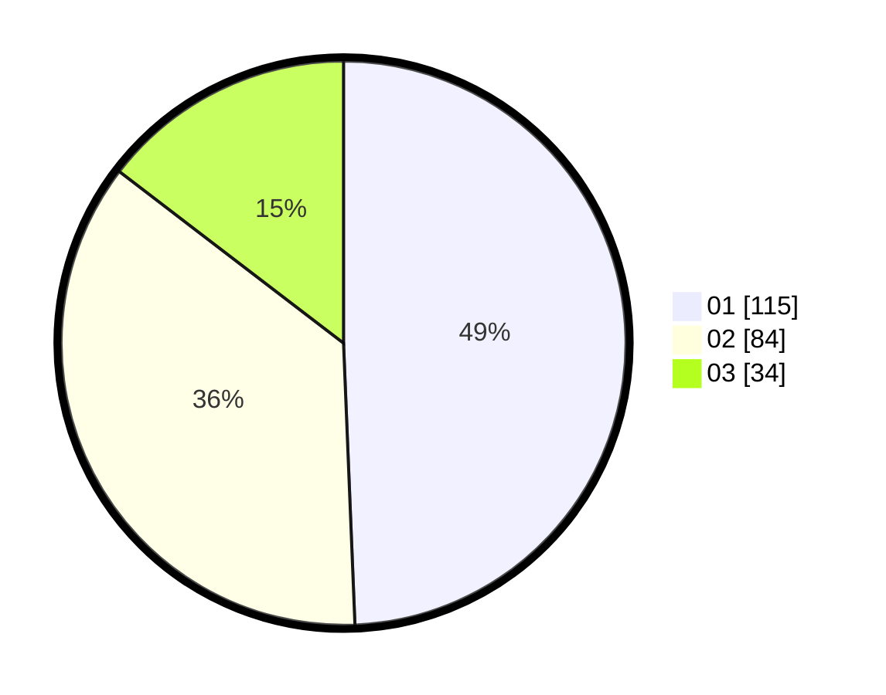

# Hasil

Hasil perolehan suara paslon dapat dilihat pada file paslon-01.txt, paslon-02.txt, dan paslon-03.txt.

Jika tidak ada, artinya data tersebut belum ada pada SIREKAP.

## Perolehan Suara

 * Paslon 01: **115**.
 * Paslon 02: **84**.
 * Paslon 03: **34**.

## Foto C Plano

https://sirekap-obj-formc.kpu.go.id/e27e/pemilu/ppwp/31/74/05/10/04/3174051004140-20240217-152407--f7f460b9-8a21-429c-bfa4-d3f505b8ff15.jpg

https://sirekap-obj-formc.kpu.go.id/e27e/pemilu/ppwp/31/74/05/10/04/3174051004140-20240217-152542--1d7e1bd0-f528-4662-9ff5-2e778f4136e7.jpg

https://sirekap-obj-formc.kpu.go.id/e27e/pemilu/ppwp/31/74/05/10/04/3174051004140-20240217-153255--8503d397-08ef-454a-8752-2e8a2af93db1.jpg

## DATA PEMILIH TETAP

Jumlah pemilih dalam DPT: **273**.
 * L: **123**.
 * P: **150**.

## DATA PENGGUNA HAK PILIH

Jumlah pengguna hak pilih dalam DPT: **207**.
 * L: **96**.
 * P: **111**.

Jumlah pengguna hak pilih dalam DPTb: **23**.
 * L: **5**.
 * P: **18**.

Jumlah pengguna hak pilih dalam DPK: **3**.
 * L: **3**.
 * P: **0**.

Jumlah pengguna hak pilih: **233**.
 * L: **104**.
 * P: **129**.

## JUMLAH SUARA SAH DAN TIDAK SAH

JUMLAH SELURUH SUARA SAH: **233**.

JUMLAH SUARA TIDAK SAH: **0**.

JUMLAH SELURUH SUARA SAH DAN SUARA TIDAK SAH: **233**.
