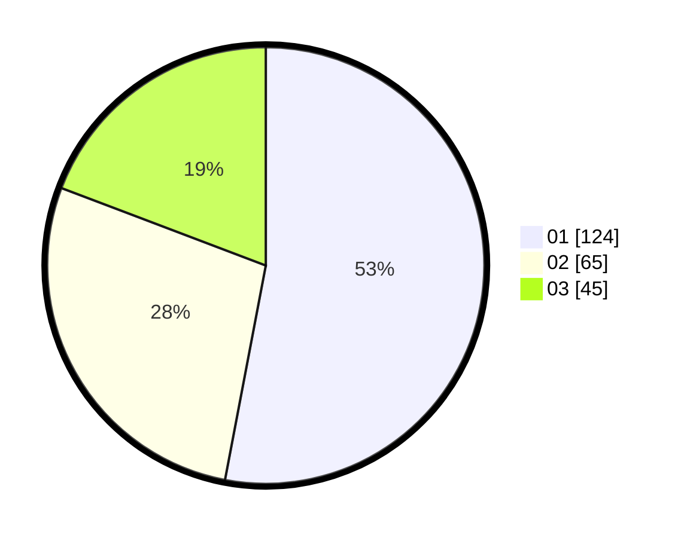

# Hasil

Hasil perolehan suara paslon dapat dilihat pada file paslon-01.txt, paslon-02.txt, dan paslon-03.txt.

Jika tidak ada, artinya data tersebut belum ada pada SIREKAP.

## Perolehan Suara

 * Paslon 01: **124**.
 * Paslon 02: **65**.
 * Paslon 03: **45**.

## Foto C Plano

https://sirekap-obj-formc.kpu.go.id/2193/pemilu/ppwp/31/74/05/10/04/3174051004141-20240215-205157--5c6ecafe-dd8d-45aa-946a-dbe26959cfdb.jpg

https://sirekap-obj-formc.kpu.go.id/2193/pemilu/ppwp/31/74/05/10/04/3174051004141-20240215-205159--da394ecf-8f5f-4c25-81a0-7ec6c9468e0b.jpg

https://sirekap-obj-formc.kpu.go.id/2193/pemilu/ppwp/31/74/05/10/04/3174051004141-20240215-205158--2ba98549-ca88-4a6f-ae9e-54123bb9b293.jpg

## DATA PEMILIH TETAP

Jumlah pemilih dalam DPT: **269**.
 * L: **122**.
 * P: **147**.

## DATA PENGGUNA HAK PILIH

Jumlah pengguna hak pilih dalam DPT: **212**.
 * L: **95**.
 * P: **117**.

Jumlah pengguna hak pilih dalam DPTb: **23**.
 * L: **4**.
 * P: **19**.

Jumlah pengguna hak pilih dalam DPK: **0**.
 * L: **0**.
 * P: **0**.

Jumlah pengguna hak pilih: **235**.
 * L: **99**.
 * P: **136**.

## JUMLAH SUARA SAH DAN TIDAK SAH

JUMLAH SELURUH SUARA SAH: **234**.

JUMLAH SUARA TIDAK SAH: **1**.

JUMLAH SELURUH SUARA SAH DAN SUARA TIDAK SAH: **235**.
