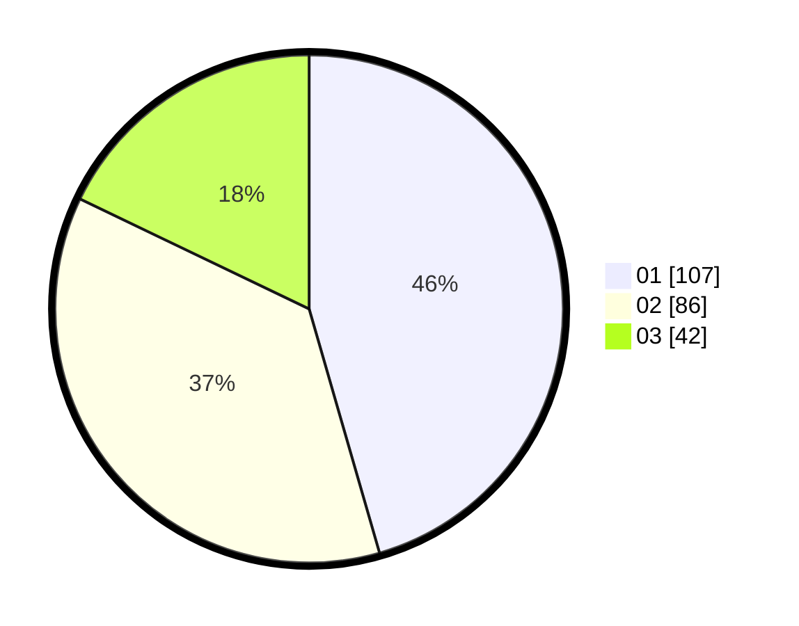

# Hasil

Hasil perolehan suara paslon dapat dilihat pada file paslon-01.txt, paslon-02.txt, dan paslon-03.txt.

Jika tidak ada, artinya data tersebut belum ada pada SIREKAP.

## Perolehan Suara

 * Paslon 01: **107**.
 * Paslon 02: **86**.
 * Paslon 03: **42**.

## Foto C Plano

https://sirekap-obj-formc.kpu.go.id/8de4/pemilu/ppwp/31/74/05/10/04/3174051004142-20240215-212612--947d7097-59c5-4a75-ae50-e598da94e8a9.jpg

https://sirekap-obj-formc.kpu.go.id/8de4/pemilu/ppwp/31/74/05/10/04/3174051004142-20240215-212615--d2383f0c-3b01-481c-9d5f-380200b7c669.jpg

https://sirekap-obj-formc.kpu.go.id/8de4/pemilu/ppwp/31/74/05/10/04/3174051004142-20240215-212613--65a0f912-052c-47c9-8e4a-06ced81fa902.jpg

## DATA PEMILIH TETAP

Jumlah pemilih dalam DPT: **270**.
 * L: **140**.
 * P: **130**.

## DATA PENGGUNA HAK PILIH

Jumlah pengguna hak pilih dalam DPT: **214**.
 * L: **108**.
 * P: **106**.

Jumlah pengguna hak pilih dalam DPTb: **27**.
 * L: **11**.
 * P: **16**.

Jumlah pengguna hak pilih dalam DPK: **0**.
 * L: **0**.
 * P: **0**.

Jumlah pengguna hak pilih: **241**.
 * L: **119**.
 * P: **122**.

## JUMLAH SUARA SAH DAN TIDAK SAH

JUMLAH SELURUH SUARA SAH: **235**.

JUMLAH SUARA TIDAK SAH: **6**.

JUMLAH SELURUH SUARA SAH DAN SUARA TIDAK SAH: **241**.
