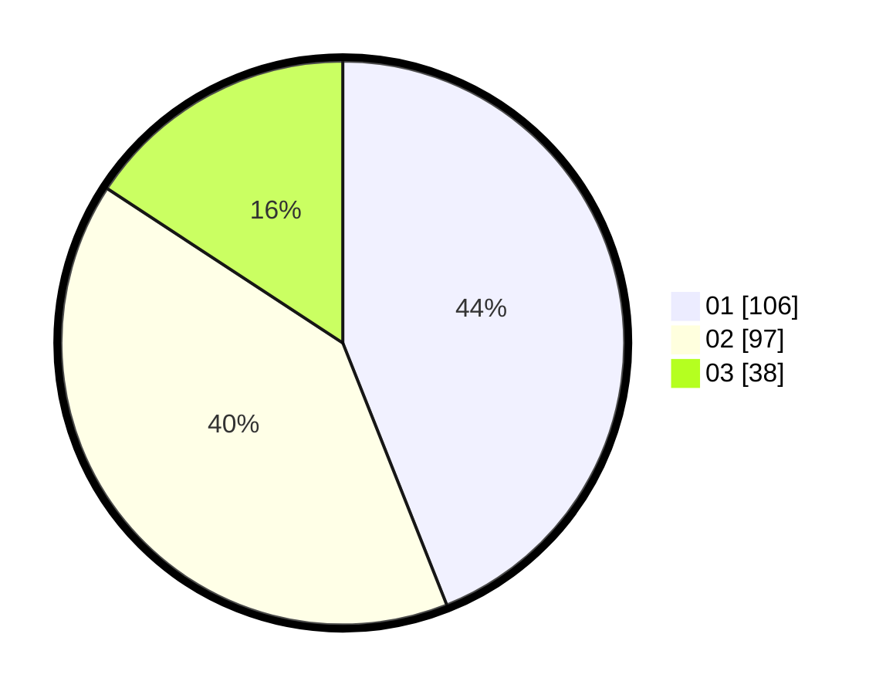

# Hasil

Hasil perolehan suara paslon dapat dilihat pada file paslon-01.txt, paslon-02.txt, dan paslon-03.txt.

Jika tidak ada, artinya data tersebut belum ada pada SIREKAP.

## Perolehan Suara

 * Paslon 01: **106**.
 * Paslon 02: **97**.
 * Paslon 03: **38**.

## Foto C Plano

https://sirekap-obj-formc.kpu.go.id/c8f2/pemilu/ppwp/31/74/05/10/04/3174051004143-20240216-131848--626e21a1-8325-40f1-913a-f16d25c83f86.jpg

https://sirekap-obj-formc.kpu.go.id/c8f2/pemilu/ppwp/31/74/05/10/04/3174051004143-20240216-131850--9f0e1763-d1f6-46dd-ba9f-086214d8ff58.jpg

https://sirekap-obj-formc.kpu.go.id/c8f2/pemilu/ppwp/31/74/05/10/04/3174051004143-20240216-131849--5d3d3203-660d-4ea9-8266-741c8251e0fb.jpg

## DATA PEMILIH TETAP

Jumlah pemilih dalam DPT: **272**.
 * L: **134**.
 * P: **138**.

## DATA PENGGUNA HAK PILIH

Jumlah pengguna hak pilih dalam DPT: **236**.
 * L: **119**.
 * P: **117**.

Jumlah pengguna hak pilih dalam DPTb: **16**.
 * L: **4**.
 * P: **12**.

Jumlah pengguna hak pilih dalam DPK: **0**.
 * L: **0**.
 * P: **0**.

Jumlah pengguna hak pilih: **252**.
 * L: **123**.
 * P: **129**.

## JUMLAH SUARA SAH DAN TIDAK SAH

JUMLAH SELURUH SUARA SAH: **241**.

JUMLAH SUARA TIDAK SAH: **11**.

JUMLAH SELURUH SUARA SAH DAN SUARA TIDAK SAH: **252**.
