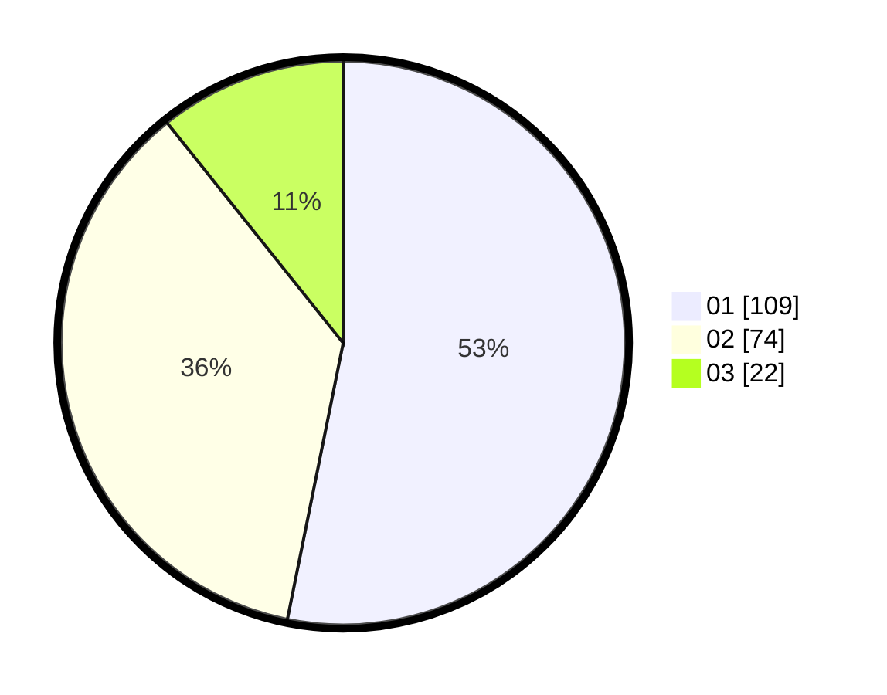

# Hasil

Hasil perolehan suara paslon dapat dilihat pada file paslon-01.txt, paslon-02.txt, dan paslon-03.txt.

Jika tidak ada, artinya data tersebut belum ada pada SIREKAP.

## Perolehan Suara

 * Paslon 01: **109**.
 * Paslon 02: **74**.
 * Paslon 03: **22**.

## Foto C Plano

https://sirekap-obj-formc.kpu.go.id/ddcf/pemilu/ppwp/31/74/05/10/05/3174051005029-20240216-154411--79878797-cd24-42b1-b042-e35175e46734.jpg

https://sirekap-obj-formc.kpu.go.id/ddcf/pemilu/ppwp/31/74/05/10/05/3174051005029-20240216-154412--7698ebf7-27fa-40d6-84d8-47f89ad4d627.jpg

https://sirekap-obj-formc.kpu.go.id/ddcf/pemilu/ppwp/31/74/05/10/05/3174051005029-20240216-154411--8c2300d0-e311-4767-9bd0-d5f756309fc5.jpg

## DATA PEMILIH TETAP

Jumlah pemilih dalam DPT: **261**.
 * L: **130**.
 * P: **131**.

## DATA PENGGUNA HAK PILIH

Jumlah pengguna hak pilih dalam DPT: **197**.
 * L: **95**.
 * P: **102**.

Jumlah pengguna hak pilih dalam DPTb: **6**.
 * L: **4**.
 * P: **2**.

Jumlah pengguna hak pilih dalam DPK: **2**.
 * L: **0**.
 * P: **2**.

Jumlah pengguna hak pilih: **205**.
 * L: **99**.
 * P: **106**.

## JUMLAH SUARA SAH DAN TIDAK SAH

JUMLAH SELURUH SUARA SAH: **205**.

JUMLAH SUARA TIDAK SAH: **0**.

JUMLAH SELURUH SUARA SAH DAN SUARA TIDAK SAH: **205**.
