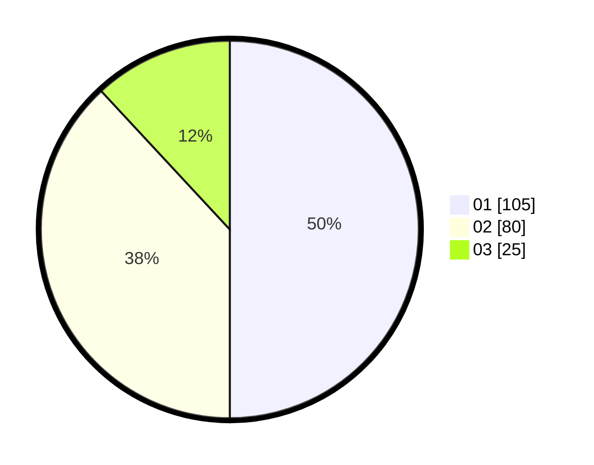

# Hasil

Hasil perolehan suara paslon dapat dilihat pada file paslon-01.txt, paslon-02.txt, dan paslon-03.txt.

Jika tidak ada, artinya data tersebut belum ada pada SIREKAP.

## Perolehan Suara

 * Paslon 01: **105**.
 * Paslon 02: **80**.
 * Paslon 03: **25**.

## Foto C Plano

https://sirekap-obj-formc.kpu.go.id/4ed0/pemilu/ppwp/31/74/05/10/05/3174051005030-20240215-032017--84666154-fefe-4656-9087-fab6eb5c8ec0.jpg

https://sirekap-obj-formc.kpu.go.id/4ed0/pemilu/ppwp/31/74/05/10/05/3174051005030-20240214-203123--7bef3734-99aa-408e-b749-7d9771d36d27.jpg

https://sirekap-obj-formc.kpu.go.id/4ed0/pemilu/ppwp/31/74/05/10/05/3174051005030-20240214-203209--de17cabf-4e3c-47ce-94f5-d5c10412e4d7.jpg
