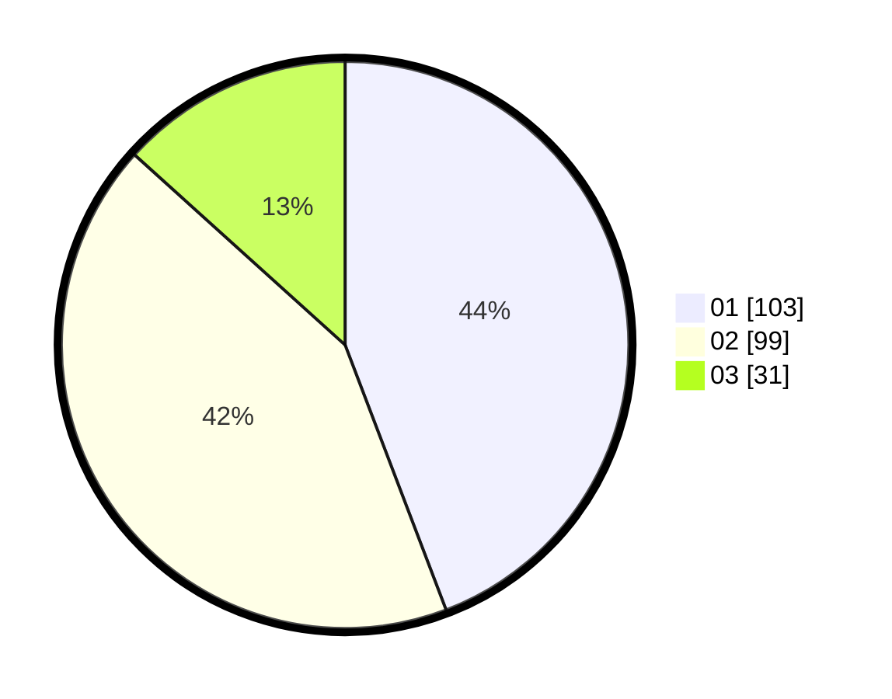

# Hasil

Hasil perolehan suara paslon dapat dilihat pada file paslon-01.txt, paslon-02.txt, dan paslon-03.txt.

Jika tidak ada, artinya data tersebut belum ada pada SIREKAP.

## Perolehan Suara

 * Paslon 01: **103**.
 * Paslon 02: **99**.
 * Paslon 03: **31**.

## Foto C Plano

https://sirekap-obj-formc.kpu.go.id/0f30/pemilu/ppwp/31/74/05/10/05/3174051005054-20240214-160106--e6841948-311d-428a-82fc-063ca7ef5557.jpg

https://sirekap-obj-formc.kpu.go.id/0f30/pemilu/ppwp/31/74/05/10/05/3174051005054-20240214-160108--d72c97d4-fa8d-4132-ac50-eee5a205530c.jpg
