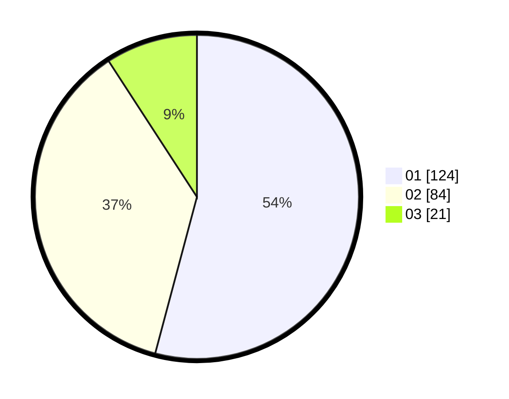

# Hasil

Hasil perolehan suara paslon dapat dilihat pada file paslon-01.txt, paslon-02.txt, dan paslon-03.txt.

Jika tidak ada, artinya data tersebut belum ada pada SIREKAP.

## Perolehan Suara

 * Paslon 01: **124**.
 * Paslon 02: **84**.
 * Paslon 03: **21**.

## Foto C Plano

https://sirekap-obj-formc.kpu.go.id/33e7/pemilu/ppwp/31/74/05/10/05/3174051005055-20240216-175901--b908e442-30ec-4f2c-b47e-7bd11e978c89.jpg

https://sirekap-obj-formc.kpu.go.id/33e7/pemilu/ppwp/31/74/05/10/05/3174051005055-20240216-175902--95fc0110-7173-44af-ab7e-4818457329bb.jpg

https://sirekap-obj-formc.kpu.go.id/33e7/pemilu/ppwp/31/74/05/10/05/3174051005055-20240216-175902--c1699cc3-d526-43a4-9fa1-a56f17ca04ac.jpg

## DATA PEMILIH TETAP

Jumlah pemilih dalam DPT: **286**.
 * L: **138**.
 * P: **148**.

## DATA PENGGUNA HAK PILIH

Jumlah pengguna hak pilih dalam DPT: **230**.
 * L: **106**.
 * P: **124**.

Jumlah pengguna hak pilih dalam DPTb: **0**.
 * L: **0**.
 * P: **0**.

Jumlah pengguna hak pilih dalam DPK: **0**.
 * L: **2**.
 * P: **0**.

Jumlah pengguna hak pilih: **232**.
 * L: **108**.
 * P: **124**.

## JUMLAH SUARA SAH DAN TIDAK SAH

JUMLAH SELURUH SUARA SAH: **229**.

JUMLAH SUARA TIDAK SAH: **3**.

JUMLAH SELURUH SUARA SAH DAN SUARA TIDAK SAH: **232**.
