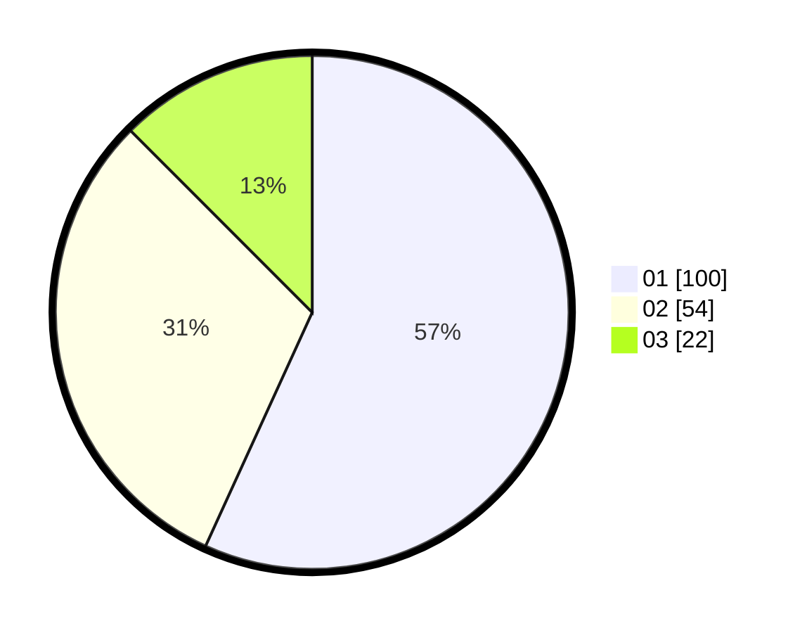

# Hasil

Hasil perolehan suara paslon dapat dilihat pada file paslon-01.txt, paslon-02.txt, dan paslon-03.txt.

Jika tidak ada, artinya data tersebut belum ada pada SIREKAP.

## Perolehan Suara

 * Paslon 01: **100**.
 * Paslon 02: **54**.
 * Paslon 03: **22**.

## Foto C Plano

https://sirekap-obj-formc.kpu.go.id/8cfb/pemilu/ppwp/31/74/05/10/05/3174051005073-20240214-200311--76453080-c1ad-49ad-b0bb-ece74022ab81.jpg

https://sirekap-obj-formc.kpu.go.id/8cfb/pemilu/ppwp/31/74/05/10/05/3174051005073-20240214-200317--d3d72f80-aa30-463a-8ea0-979121e41609.jpg

https://sirekap-obj-formc.kpu.go.id/8cfb/pemilu/ppwp/31/74/05/10/05/3174051005073-20240214-200324--3165eeb7-72ad-4bed-ba7e-01192cb10c5c.jpg

## DATA PEMILIH TETAP

Jumlah pemilih dalam DPT: **205**.
 * L: **103**.
 * P: **102**.

## DATA PENGGUNA HAK PILIH

Jumlah pengguna hak pilih dalam DPT: **172**.
 * L: **86**.
 * P: **86**.

Jumlah pengguna hak pilih dalam DPTb: **6**.
 * L: **2**.
 * P: **4**.

Jumlah pengguna hak pilih dalam DPK: **1**.
 * L: **1**.
 * P: **0**.

Jumlah pengguna hak pilih: **179**.
 * L: **89**.
 * P: **90**.

## JUMLAH SUARA SAH DAN TIDAK SAH

JUMLAH SELURUH SUARA SAH: **176**.

JUMLAH SUARA TIDAK SAH: **3**.

JUMLAH SELURUH SUARA SAH DAN SUARA TIDAK SAH: **179**.
