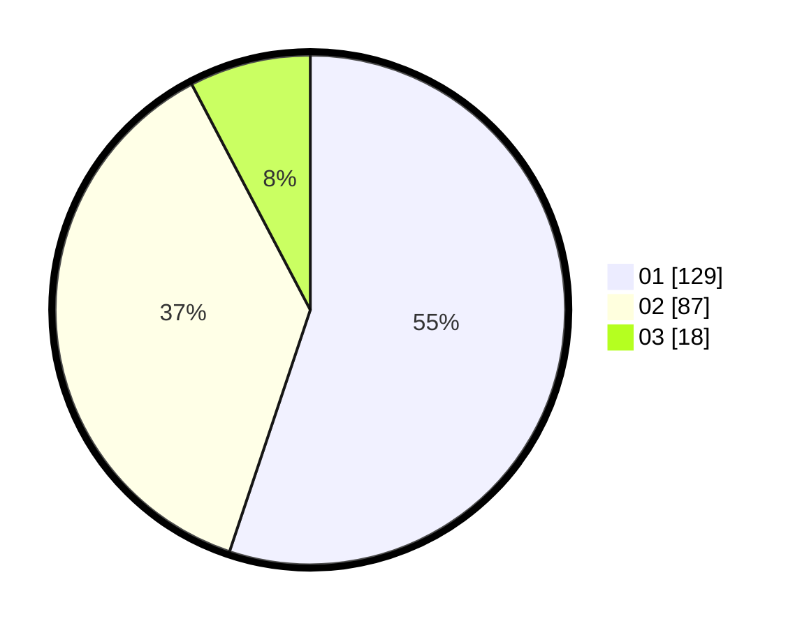

# Hasil

Hasil perolehan suara paslon dapat dilihat pada file paslon-01.txt, paslon-02.txt, dan paslon-03.txt.

Jika tidak ada, artinya data tersebut belum ada pada SIREKAP.

## Perolehan Suara

 * Paslon 01: **129**.
 * Paslon 02: **87**.
 * Paslon 03: **18**.

## Foto C Plano

https://sirekap-obj-formc.kpu.go.id/48ae/pemilu/ppwp/31/74/05/10/05/3174051005078-20240214-191210--1feb46b6-753d-4a0e-8883-e0e62287c177.jpg

https://sirekap-obj-formc.kpu.go.id/48ae/pemilu/ppwp/31/74/05/10/05/3174051005078-20240214-191201--698cf417-2ab1-47ec-af60-61b9405f7b8b.jpg

https://sirekap-obj-formc.kpu.go.id/48ae/pemilu/ppwp/31/74/05/10/05/3174051005078-20240214-191216--d7ad697a-6a94-462c-b85d-c26497220ede.jpg

## DATA PEMILIH TETAP

Jumlah pemilih dalam DPT: **288**.
 * L: **143**.
 * P: **145**.

## DATA PENGGUNA HAK PILIH

Jumlah pengguna hak pilih dalam DPT: **233**.
 * L: **112**.
 * P: **121**.

Jumlah pengguna hak pilih dalam DPTb: **2**.
 * L: **1**.
 * P: **1**.

Jumlah pengguna hak pilih dalam DPK: **1**.
 * L: **1**.
 * P: **0**.

Jumlah pengguna hak pilih: **236**.
 * L: **114**.
 * P: **122**.

## JUMLAH SUARA SAH DAN TIDAK SAH

JUMLAH SELURUH SUARA SAH: **234**.

JUMLAH SUARA TIDAK SAH: **2**.

JUMLAH SELURUH SUARA SAH DAN SUARA TIDAK SAH: **236**.
