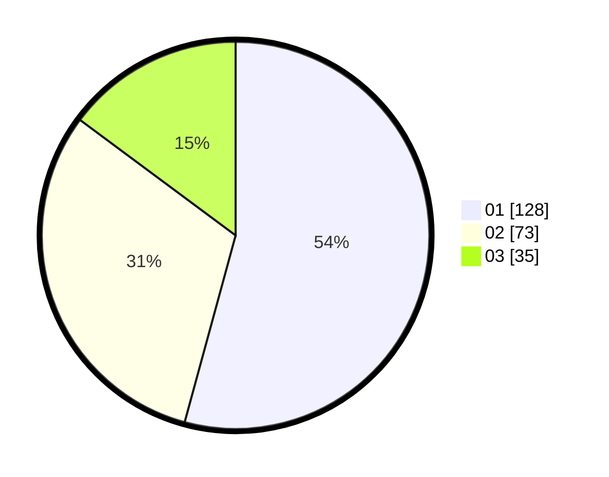

# Hasil

Hasil perolehan suara paslon dapat dilihat pada file paslon-01.txt, paslon-02.txt, dan paslon-03.txt.

Jika tidak ada, artinya data tersebut belum ada pada SIREKAP.

## Perolehan Suara

 * Paslon 01: **128**.
 * Paslon 02: **73**.
 * Paslon 03: **35**.

## Foto C Plano

https://sirekap-obj-formc.kpu.go.id/11eb/pemilu/ppwp/31/74/05/10/05/3174051005087-20240214-185234--9f6f6f53-6457-48cc-b51b-33fbf202b633.jpg

https://sirekap-obj-formc.kpu.go.id/11eb/pemilu/ppwp/31/74/05/10/05/3174051005087-20240214-185409--c7093740-9422-4a2f-a0ec-863bddafda78.jpg
