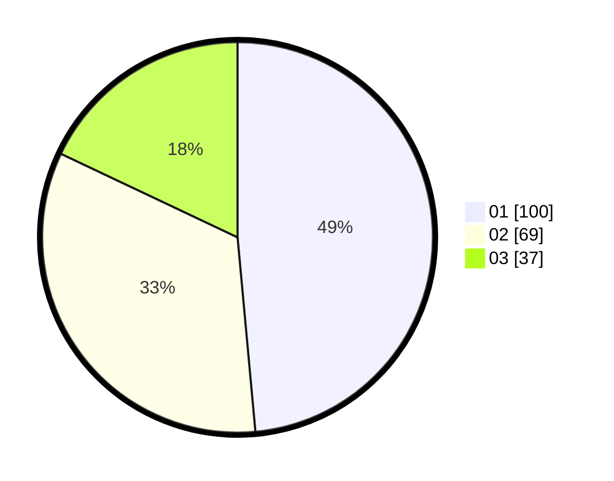

# Hasil

Hasil perolehan suara paslon dapat dilihat pada file paslon-01.txt, paslon-02.txt, dan paslon-03.txt.

Jika tidak ada, artinya data tersebut belum ada pada SIREKAP.

## Perolehan Suara

 * Paslon 01: **100**.
 * Paslon 02: **69**.
 * Paslon 03: **37**.

## Foto C Plano

https://sirekap-obj-formc.kpu.go.id/99b3/pemilu/ppwp/31/74/05/10/05/3174051005103-20240216-172048--0947aacb-ab60-47eb-afc9-ba5d239b569a.jpg

https://sirekap-obj-formc.kpu.go.id/99b3/pemilu/ppwp/31/74/05/10/05/3174051005103-20240216-172050--68b00a49-b969-42cc-94da-c14aa35a25a9.jpg

https://sirekap-obj-formc.kpu.go.id/99b3/pemilu/ppwp/31/74/05/10/05/3174051005103-20240216-172049--134ab706-12cc-4248-b0e6-ba45302a840e.jpg

## DATA PEMILIH TETAP

Jumlah pemilih dalam DPT: **261**.
 * L: **133**.
 * P: **128**.

## DATA PENGGUNA HAK PILIH

Jumlah pengguna hak pilih dalam DPT: **207**.
 * L: **102**.
 * P: **105**.

Jumlah pengguna hak pilih dalam DPTb: **1**.
 * L: **0**.
 * P: **1**.

Jumlah pengguna hak pilih dalam DPK: **1**.
 * L: **0**.
 * P: **1**.

Jumlah pengguna hak pilih: **209**.
 * L: **102**.
 * P: **107**.

## JUMLAH SUARA SAH DAN TIDAK SAH

JUMLAH SELURUH SUARA SAH: **206**.

JUMLAH SUARA TIDAK SAH: **3**.

JUMLAH SELURUH SUARA SAH DAN SUARA TIDAK SAH: **209**.
