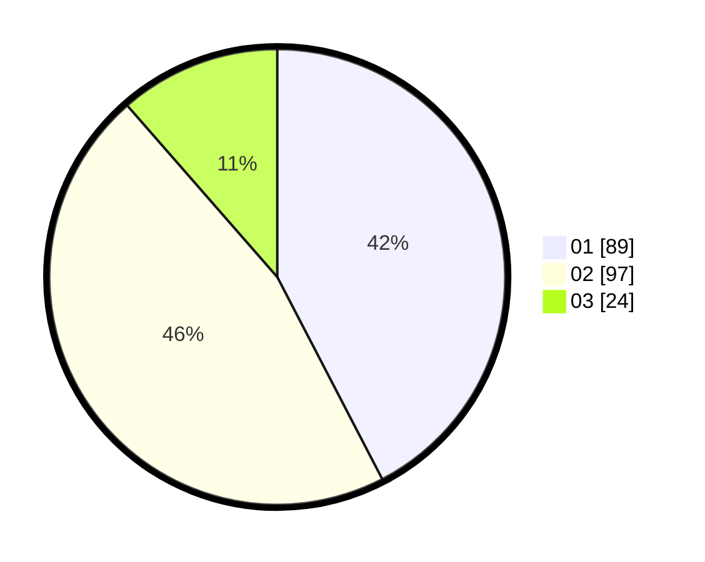

# Hasil

Hasil perolehan suara paslon dapat dilihat pada file paslon-01.txt, paslon-02.txt, dan paslon-03.txt.

Jika tidak ada, artinya data tersebut belum ada pada SIREKAP.

## Perolehan Suara

 * Paslon 01: **89**.
 * Paslon 02: **97**.
 * Paslon 03: **24**.

## Foto C Plano

https://sirekap-obj-formc.kpu.go.id/f426/pemilu/ppwp/31/74/05/10/05/3174051005119-20240215-232637--a913a92c-47ca-4869-8c3f-676f44bf7c4f.jpg

https://sirekap-obj-formc.kpu.go.id/f426/pemilu/ppwp/31/74/05/10/05/3174051005119-20240215-231854--a6891b6d-f57e-465c-80ea-2b1fa3cd1266.jpg

https://sirekap-obj-formc.kpu.go.id/f426/pemilu/ppwp/31/74/05/10/05/3174051005119-20240215-231945--355aab80-848b-424d-81a7-ab08f6d0e243.jpg

## DATA PEMILIH TETAP

Jumlah pemilih dalam DPT: **252**.
 * L: **124**.
 * P: **128**.

## DATA PENGGUNA HAK PILIH

Jumlah pengguna hak pilih dalam DPT: **209**.
 * L: **99**.
 * P: **110**.

Jumlah pengguna hak pilih dalam DPTb: **3**.
 * L: **2**.
 * P: **1**.

Jumlah pengguna hak pilih dalam DPK: **2**.
 * L: **0**.
 * P: **2**.

Jumlah pengguna hak pilih: **214**.
 * L: **101**.
 * P: **113**.

## JUMLAH SUARA SAH DAN TIDAK SAH

JUMLAH SELURUH SUARA SAH: **210**.

JUMLAH SUARA TIDAK SAH: **4**.

JUMLAH SELURUH SUARA SAH DAN SUARA TIDAK SAH: **214**.
