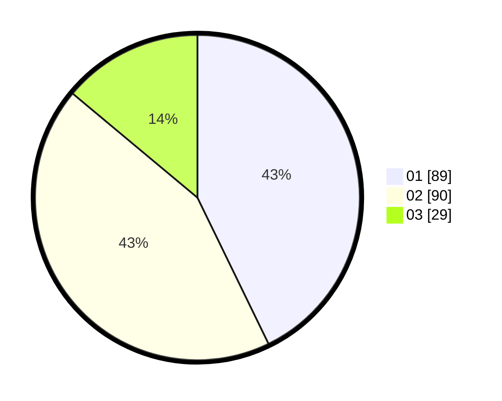

# Hasil

Hasil perolehan suara paslon dapat dilihat pada file paslon-01.txt, paslon-02.txt, dan paslon-03.txt.

Jika tidak ada, artinya data tersebut belum ada pada SIREKAP.

## Perolehan Suara

 * Paslon 01: **89**.
 * Paslon 02: **90**.
 * Paslon 03: **29**.

## Foto C Plano

https://sirekap-obj-formc.kpu.go.id/eb71/pemilu/ppwp/31/74/05/10/05/3174051005126-20240215-041449--3847dd56-4212-4ed2-a13d-ddda2dcbe4cb.jpg

https://sirekap-obj-formc.kpu.go.id/eb71/pemilu/ppwp/31/74/05/10/05/3174051005126-20240215-041511--52a1bf4d-0ee9-40f9-baad-de5b1a1e676a.jpg

https://sirekap-obj-formc.kpu.go.id/eb71/pemilu/ppwp/31/74/05/10/05/3174051005126-20240215-041500--10e8adb3-c599-4522-9488-b5f5efed1d98.jpg

## DATA PEMILIH TETAP

Jumlah pemilih dalam DPT: **207**.
 * L: **107**.
 * P: **100**.

## DATA PENGGUNA HAK PILIH

Jumlah pengguna hak pilih dalam DPT: **251**.
 * L: **129**.
 * P: **122**.

Jumlah pengguna hak pilih dalam DPTb: **0**.
 * L: **0**.
 * P: **0**.

Jumlah pengguna hak pilih dalam DPK: **1**.
 * L: **0**.
 * P: **1**.

Jumlah pengguna hak pilih: **252**.
 * L: **129**.
 * P: **123**.

## JUMLAH SUARA SAH DAN TIDAK SAH

JUMLAH SELURUH SUARA SAH: **208**.

JUMLAH SUARA TIDAK SAH: **0**.

JUMLAH SELURUH SUARA SAH DAN SUARA TIDAK SAH: **208**.
