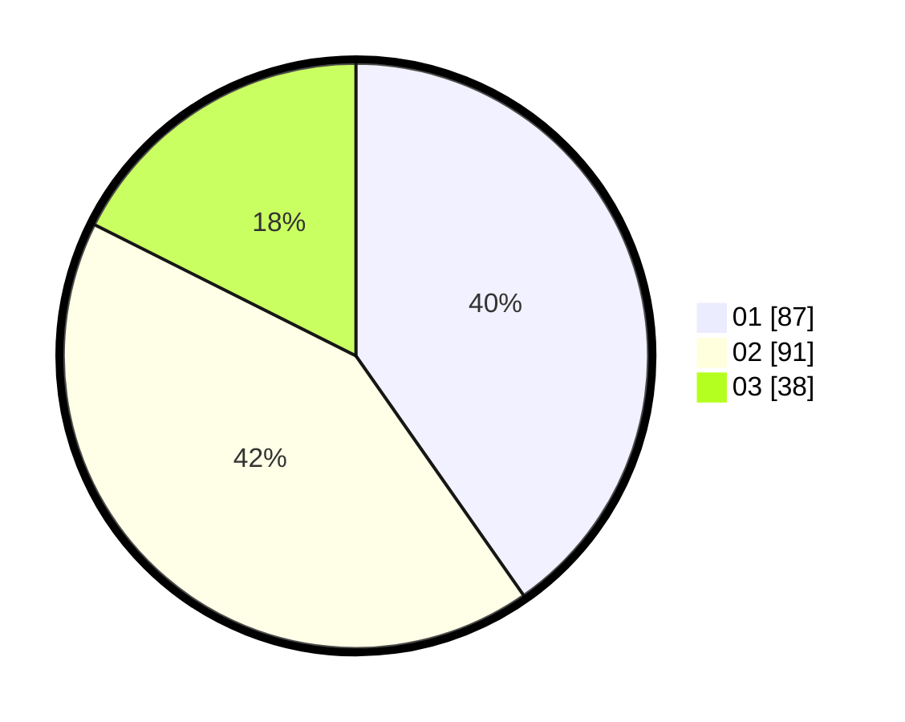

# Hasil

Hasil perolehan suara paslon dapat dilihat pada file paslon-01.txt, paslon-02.txt, dan paslon-03.txt.

Jika tidak ada, artinya data tersebut belum ada pada SIREKAP.

## Perolehan Suara

 * Paslon 01: **87**.
 * Paslon 02: **91**.
 * Paslon 03: **38**.

## Foto C Plano

https://sirekap-obj-formc.kpu.go.id/a5aa/pemilu/ppwp/31/74/05/10/06/3174051006002-20240214-220727--5e872284-7d94-4bba-8ab0-0b008ca967f4.jpg

https://sirekap-obj-formc.kpu.go.id/a5aa/pemilu/ppwp/31/74/05/10/06/3174051006002-20240215-005219--985c7a7d-df7d-41b5-af01-1e9d86e5d075.jpg
