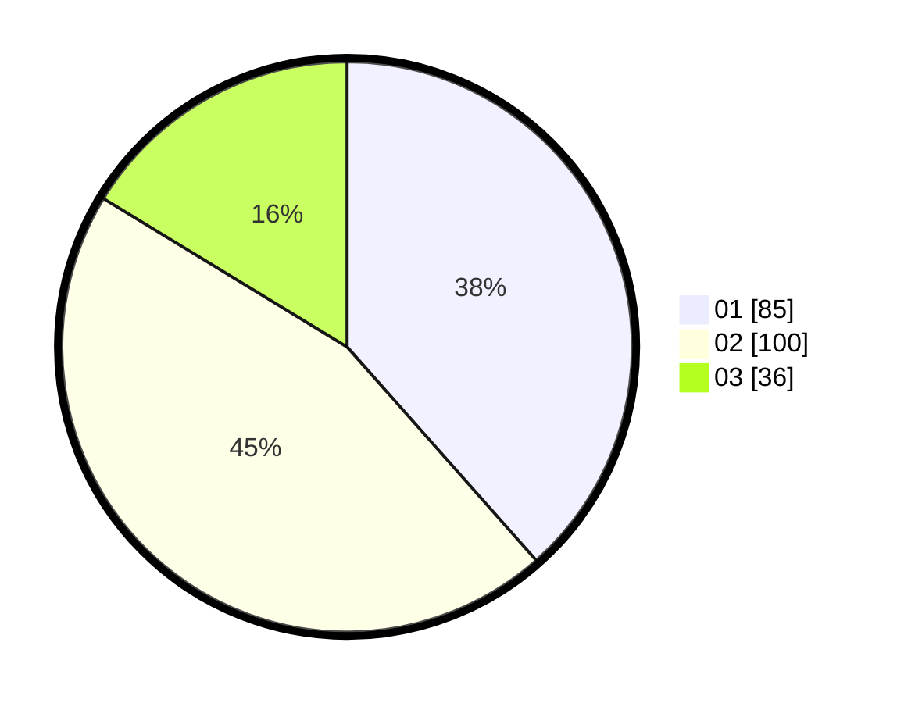

# Hasil

Hasil perolehan suara paslon dapat dilihat pada file paslon-01.txt, paslon-02.txt, dan paslon-03.txt.

Jika tidak ada, artinya data tersebut belum ada pada SIREKAP.

## Perolehan Suara

 * Paslon 01: **85**.
 * Paslon 02: **100**.
 * Paslon 03: **36**.

## Foto C Plano

https://sirekap-obj-formc.kpu.go.id/026c/pemilu/ppwp/31/74/05/10/06/3174051006018-20240215-234609--3a3093d8-eabd-456e-97c8-260ced752c25.jpg

https://sirekap-obj-formc.kpu.go.id/026c/pemilu/ppwp/31/74/05/10/06/3174051006018-20240215-234617--e0fe4bdb-2ced-4fe9-bb2e-95ce3a6c2cc1.jpg

https://sirekap-obj-formc.kpu.go.id/026c/pemilu/ppwp/31/74/05/10/06/3174051006018-20240215-234612--e06d0997-aeca-4396-ae0f-026b0d0c0ee8.jpg

## DATA PEMILIH TETAP

Jumlah pemilih dalam DPT: **0**.
 * L: **0**.
 * P: **0**.

## DATA PENGGUNA HAK PILIH

Jumlah pengguna hak pilih dalam DPT: **218**.
 * L: **101**.
 * P: **117**.

Jumlah pengguna hak pilih dalam DPTb: **6**.
 * L: **3**.
 * P: **3**.

Jumlah pengguna hak pilih dalam DPK: **0**.
 * L: **0**.
 * P: **0**.

Jumlah pengguna hak pilih: **224**.
 * L: **104**.
 * P: **120**.

## JUMLAH SUARA SAH DAN TIDAK SAH

JUMLAH SELURUH SUARA SAH: **221**.

JUMLAH SUARA TIDAK SAH: **3**.

JUMLAH SELURUH SUARA SAH DAN SUARA TIDAK SAH: **224**.
