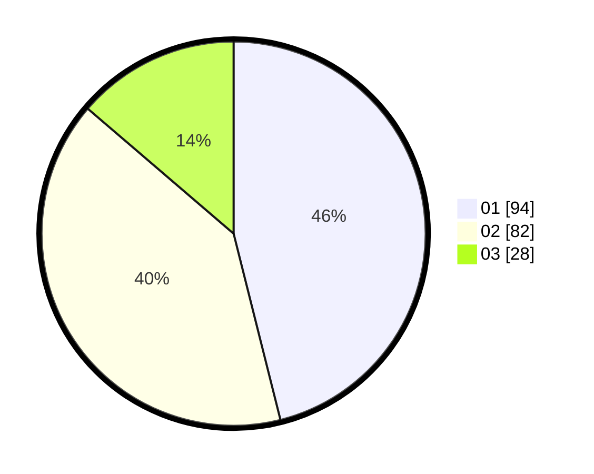

# Hasil

Hasil perolehan suara paslon dapat dilihat pada file paslon-01.txt, paslon-02.txt, dan paslon-03.txt.

Jika tidak ada, artinya data tersebut belum ada pada SIREKAP.

## Perolehan Suara

 * Paslon 01: **94**.
 * Paslon 02: **82**.
 * Paslon 03: **28**.

## Foto C Plano

https://sirekap-obj-formc.kpu.go.id/d454/pemilu/ppwp/31/74/05/10/06/3174051006035-20240215-002436--be252ddc-00e6-4d7d-b848-387e469c2818.jpg

https://sirekap-obj-formc.kpu.go.id/d454/pemilu/ppwp/31/74/05/10/06/3174051006035-20240215-002242--ffb09d01-cf59-46f4-9dbb-9703b9bda655.jpg

https://sirekap-obj-formc.kpu.go.id/d454/pemilu/ppwp/31/74/05/10/06/3174051006035-20240215-002001--dd9cfbe9-ed91-4193-88d9-880142dea00f.jpg

## DATA PEMILIH TETAP

Jumlah pemilih dalam DPT: **261**.
 * L: **127**.
 * P: **134**.

## DATA PENGGUNA HAK PILIH

Jumlah pengguna hak pilih dalam DPT: **208**.
 * L: **99**.
 * P: **109**.

Jumlah pengguna hak pilih dalam DPTb: **0**.
 * L: **0**.
 * P: **0**.

Jumlah pengguna hak pilih dalam DPK: **0**.
 * L: **0**.
 * P: **0**.

Jumlah pengguna hak pilih: **208**.
 * L: **99**.
 * P: **109**.

## JUMLAH SUARA SAH DAN TIDAK SAH

JUMLAH SELURUH SUARA SAH: **204**.

JUMLAH SUARA TIDAK SAH: **4**.

JUMLAH SELURUH SUARA SAH DAN SUARA TIDAK SAH: **208**.
