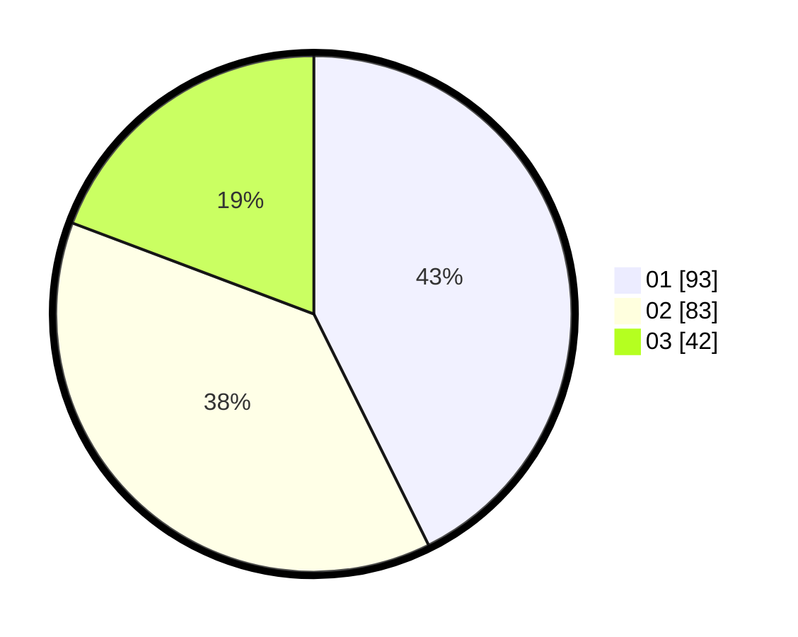

# Hasil

Hasil perolehan suara paslon dapat dilihat pada file paslon-01.txt, paslon-02.txt, dan paslon-03.txt.

Jika tidak ada, artinya data tersebut belum ada pada SIREKAP.

## Perolehan Suara

 * Paslon 01: **93**.
 * Paslon 02: **83**.
 * Paslon 03: **42**.

## Foto C Plano

https://sirekap-obj-formc.kpu.go.id/7bd0/pemilu/ppwp/31/74/05/10/06/3174051006039-20240214-205842--d7fe07c6-1b61-4e83-b34f-fb7d65792bbb.jpg

https://sirekap-obj-formc.kpu.go.id/7bd0/pemilu/ppwp/31/74/05/10/06/3174051006039-20240214-205845--61cc696a-dc88-450f-8622-eba44d5af169.jpg

https://sirekap-obj-formc.kpu.go.id/7bd0/pemilu/ppwp/31/74/05/10/06/3174051006039-20240214-205848--4138c93e-2f92-420a-89c4-f03e9eab39c4.jpg

## DATA PEMILIH TETAP

Jumlah pemilih dalam DPT: **295**.
 * L: **144**.
 * P: **151**.

## DATA PENGGUNA HAK PILIH

Jumlah pengguna hak pilih dalam DPT: **219**.
 * L: **104**.
 * P: **115**.

Jumlah pengguna hak pilih dalam DPTb: **0**.
 * L: **0**.
 * P: **0**.

Jumlah pengguna hak pilih dalam DPK: **1**.
 * L: **1**.
 * P: **0**.

Jumlah pengguna hak pilih: **220**.
 * L: **105**.
 * P: **115**.

## JUMLAH SUARA SAH DAN TIDAK SAH

JUMLAH SELURUH SUARA SAH: **218**.

JUMLAH SUARA TIDAK SAH: **2**.

JUMLAH SELURUH SUARA SAH DAN SUARA TIDAK SAH: **220**.
