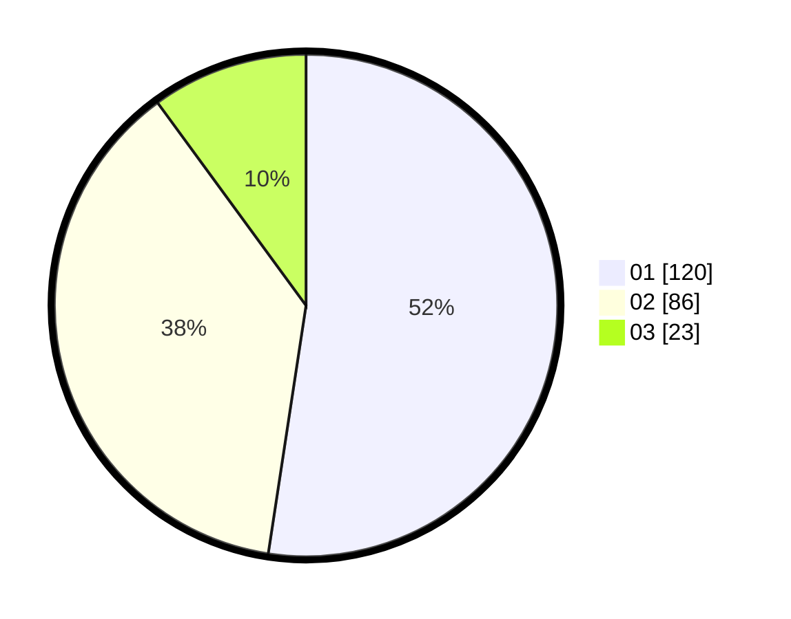

# Hasil

Hasil perolehan suara paslon dapat dilihat pada file paslon-01.txt, paslon-02.txt, dan paslon-03.txt.

Jika tidak ada, artinya data tersebut belum ada pada SIREKAP.

## Perolehan Suara

 * Paslon 01: **120**.
 * Paslon 02: **86**.
 * Paslon 03: **23**.

## Foto C Plano

https://sirekap-obj-formc.kpu.go.id/c8ba/pemilu/ppwp/31/74/05/10/06/3174051006043-20240214-192440--263b9c6f-f761-4728-a48a-c84c188fdfb2.jpg

https://sirekap-obj-formc.kpu.go.id/c8ba/pemilu/ppwp/31/74/05/10/06/3174051006043-20240214-192557--d1cf45ed-cb36-40b9-955a-a585a4c0e408.jpg

https://sirekap-obj-formc.kpu.go.id/c8ba/pemilu/ppwp/31/74/05/10/06/3174051006043-20240214-192638--19dc0fbf-7870-427c-9fe2-9e5faee8b70a.jpg

## DATA PEMILIH TETAP

Jumlah pemilih dalam DPT: **296**.
 * L: **142**.
 * P: **154**.

## DATA PENGGUNA HAK PILIH

Jumlah pengguna hak pilih dalam DPT: **230**.
 * L: **107**.
 * P: **123**.

Jumlah pengguna hak pilih dalam DPTb: **4**.
 * L: **1**.
 * P: **3**.

Jumlah pengguna hak pilih dalam DPK: **2**.
 * L: **1**.
 * P: **1**.

Jumlah pengguna hak pilih: **236**.
 * L: **109**.
 * P: **127**.

## JUMLAH SUARA SAH DAN TIDAK SAH

JUMLAH SELURUH SUARA SAH: **229**.

JUMLAH SUARA TIDAK SAH: **7**.

JUMLAH SELURUH SUARA SAH DAN SUARA TIDAK SAH: **236**.
