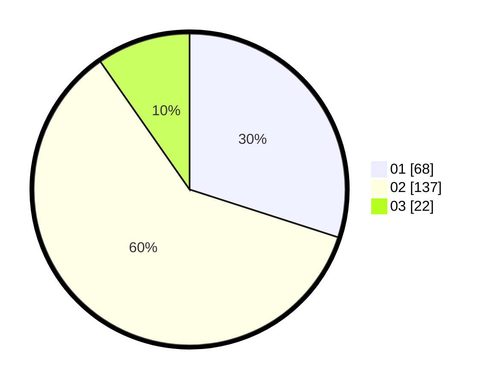

# Hasil

Hasil perolehan suara paslon dapat dilihat pada file paslon-01.txt, paslon-02.txt, dan paslon-03.txt.

Jika tidak ada, artinya data tersebut belum ada pada SIREKAP.

## Perolehan Suara

 * Paslon 01: **68**.
 * Paslon 02: **137**.
 * Paslon 03: **22**.

## Foto C Plano

https://sirekap-obj-formc.kpu.go.id/c9c7/pemilu/ppwp/31/74/05/10/06/3174051006055-20240214-210702--99ecf720-ad39-412a-b70d-c6cddcbdce55.jpg

https://sirekap-obj-formc.kpu.go.id/c9c7/pemilu/ppwp/31/74/05/10/06/3174051006055-20240214-210810--5c325701-2e09-49d6-849b-5a98001bbf8a.jpg

https://sirekap-obj-formc.kpu.go.id/c9c7/pemilu/ppwp/31/74/05/10/06/3174051006055-20240214-210901--e9c2c893-10c2-4da9-ba20-a7f9eec32a59.jpg

## DATA PEMILIH TETAP

Jumlah pemilih dalam DPT: **289**.
 * L: **144**.
 * P: **145**.

## DATA PENGGUNA HAK PILIH

Jumlah pengguna hak pilih dalam DPT: **225**.
 * L: **108**.
 * P: **117**.

Jumlah pengguna hak pilih dalam DPTb: **4**.
 * L: **0**.
 * P: **4**.

Jumlah pengguna hak pilih dalam DPK: **2**.
 * L: **1**.
 * P: **1**.

Jumlah pengguna hak pilih: **231**.
 * L: **109**.
 * P: **122**.

## JUMLAH SUARA SAH DAN TIDAK SAH

JUMLAH SELURUH SUARA SAH: **227**.

JUMLAH SUARA TIDAK SAH: **4**.

JUMLAH SELURUH SUARA SAH DAN SUARA TIDAK SAH: **231**.
