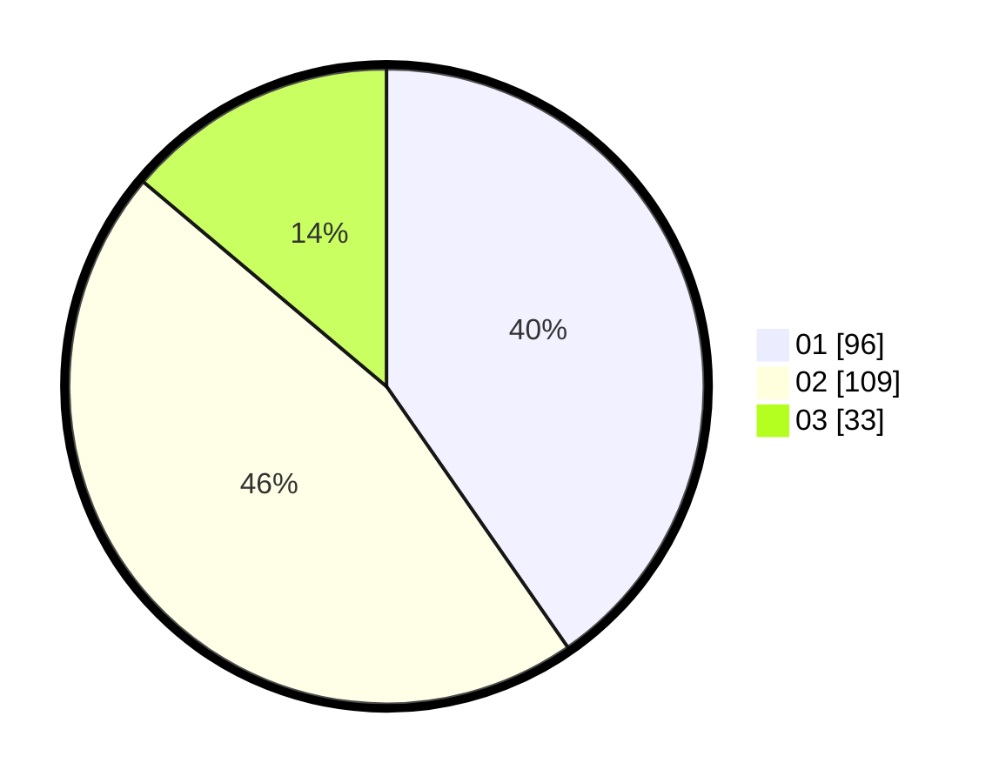

# Hasil

Hasil perolehan suara paslon dapat dilihat pada file paslon-01.txt, paslon-02.txt, dan paslon-03.txt.

Jika tidak ada, artinya data tersebut belum ada pada SIREKAP.

## Perolehan Suara

 * Paslon 01: **96**.
 * Paslon 02: **109**.
 * Paslon 03: **33**.

## Foto C Plano

https://sirekap-obj-formc.kpu.go.id/4b87/pemilu/ppwp/31/74/05/10/06/3174051006056-20240216-082520--caa469e1-6974-4c2d-b1db-41e8a745e099.jpg

https://sirekap-obj-formc.kpu.go.id/4b87/pemilu/ppwp/31/74/05/10/06/3174051006056-20240216-082537--1950ed3e-2d45-4c9b-98bd-59de213fbcb0.jpg

https://sirekap-obj-formc.kpu.go.id/4b87/pemilu/ppwp/31/74/05/10/06/3174051006056-20240216-130228--54f35537-72f8-44c9-838a-0c9689839991.jpg

## DATA PEMILIH TETAP

Jumlah pemilih dalam DPT: **270**.
 * L: **128**.
 * P: **142**.

## DATA PENGGUNA HAK PILIH

Jumlah pengguna hak pilih dalam DPT: **234**.
 * L: **109**.
 * P: **125**.

Jumlah pengguna hak pilih dalam DPTb: **0**.
 * L: **0**.
 * P: **0**.

Jumlah pengguna hak pilih dalam DPK: **7**.
 * L: **1**.
 * P: **6**.

Jumlah pengguna hak pilih: **241**.
 * L: **110**.
 * P: **131**.

## JUMLAH SUARA SAH DAN TIDAK SAH

JUMLAH SELURUH SUARA SAH: **238**.

JUMLAH SUARA TIDAK SAH: **3**.

JUMLAH SELURUH SUARA SAH DAN SUARA TIDAK SAH: **241**.
