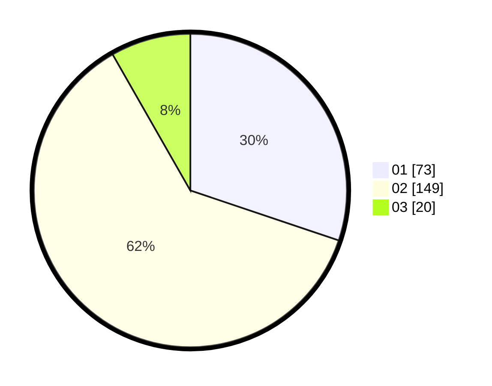

# Hasil

Hasil perolehan suara paslon dapat dilihat pada file paslon-01.txt, paslon-02.txt, dan paslon-03.txt.

Jika tidak ada, artinya data tersebut belum ada pada SIREKAP.

## Perolehan Suara

 * Paslon 01: **73**.
 * Paslon 02: **149**.
 * Paslon 03: **20**.

## Foto C Plano

https://sirekap-obj-formc.kpu.go.id/29a0/pemilu/ppwp/31/74/05/10/06/3174051006065-20240214-231329--b91e5018-66f2-495b-9780-ba1bd968df94.jpg

https://sirekap-obj-formc.kpu.go.id/29a0/pemilu/ppwp/31/74/05/10/06/3174051006065-20240214-204109--19fd7d07-da27-466e-9019-1f7f65ca005d.jpg

https://sirekap-obj-formc.kpu.go.id/29a0/pemilu/ppwp/31/74/05/10/06/3174051006065-20240214-211735--2ba03273-9048-4f8e-bec0-9ecefcce3355.jpg

## DATA PEMILIH TETAP

Jumlah pemilih dalam DPT: **297**.
 * L: **135**.
 * P: **162**.

## DATA PENGGUNA HAK PILIH

Jumlah pengguna hak pilih dalam DPT: **244**.
 * L: **113**.
 * P: **131**.

Jumlah pengguna hak pilih dalam DPTb: **0**.
 * L: **0**.
 * P: **0**.

Jumlah pengguna hak pilih dalam DPK: **0**.
 * L: **0**.
 * P: **0**.

Jumlah pengguna hak pilih: **244**.
 * L: **113**.
 * P: **131**.

## JUMLAH SUARA SAH DAN TIDAK SAH

JUMLAH SELURUH SUARA SAH: **242**.

JUMLAH SUARA TIDAK SAH: **2**.

JUMLAH SELURUH SUARA SAH DAN SUARA TIDAK SAH: **244**.
