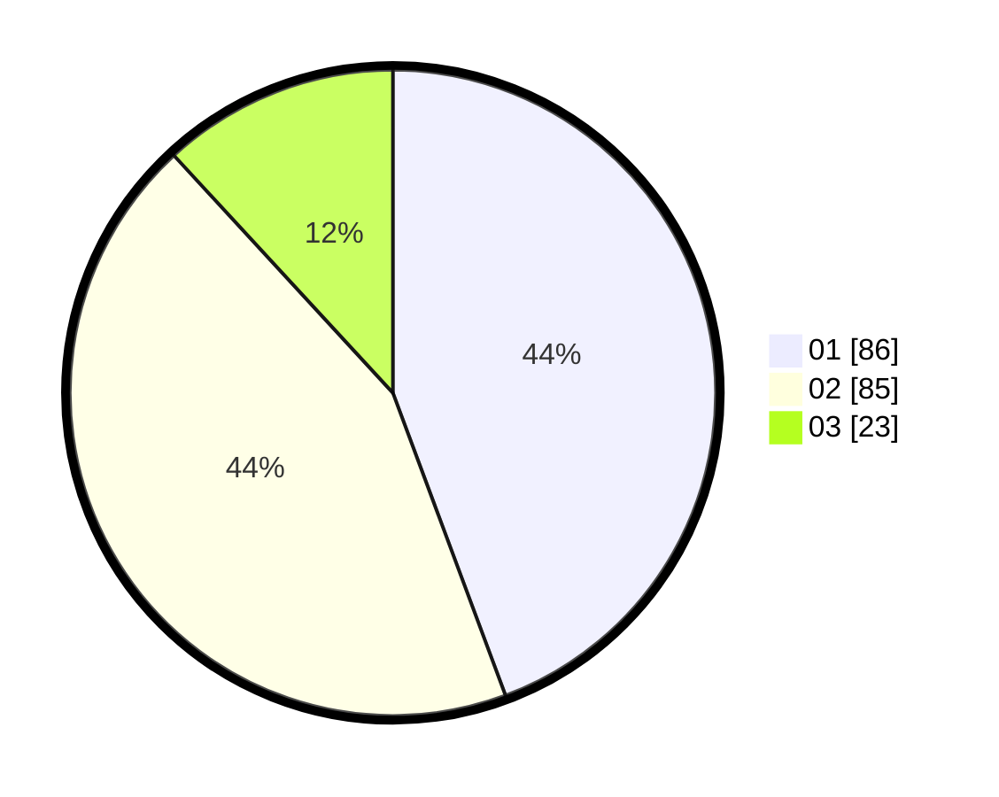

# Hasil

Hasil perolehan suara paslon dapat dilihat pada file paslon-01.txt, paslon-02.txt, dan paslon-03.txt.

Jika tidak ada, artinya data tersebut belum ada pada SIREKAP.

## Perolehan Suara

 * Paslon 01: **86**.
 * Paslon 02: **85**.
 * Paslon 03: **23**.

## Foto C Plano

https://sirekap-obj-formc.kpu.go.id/b4dc/pemilu/ppwp/31/74/05/10/06/3174051006070-20240214-224933--591dcc44-806a-4f7e-92cf-02e58e9bd91b.jpg

https://sirekap-obj-formc.kpu.go.id/b4dc/pemilu/ppwp/31/74/05/10/06/3174051006070-20240214-203645--877100ac-b507-4d73-a818-f1a8fa8ccc71.jpg

https://sirekap-obj-formc.kpu.go.id/b4dc/pemilu/ppwp/31/74/05/10/06/3174051006070-20240214-203650--bdd9aa7b-45b9-4a26-a807-ada6d0a5a52f.jpg
