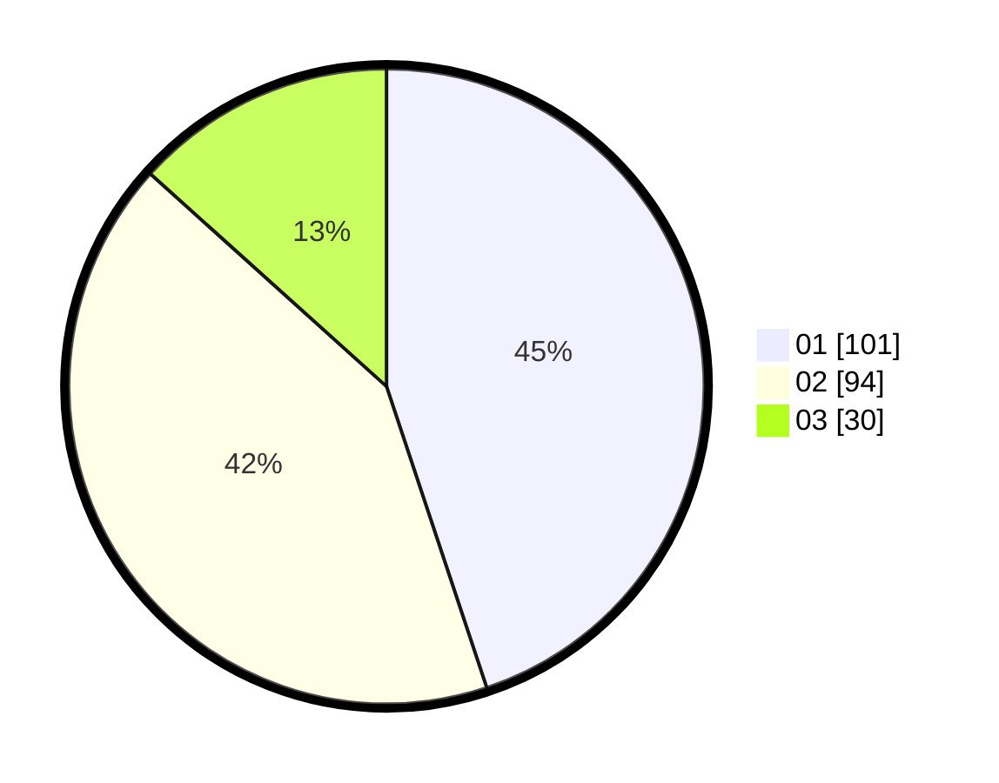

# Hasil

Hasil perolehan suara paslon dapat dilihat pada file paslon-01.txt, paslon-02.txt, dan paslon-03.txt.

Jika tidak ada, artinya data tersebut belum ada pada SIREKAP.

## Perolehan Suara

 * Paslon 01: **101**.
 * Paslon 02: **94**.
 * Paslon 03: **30**.

## Foto C Plano

https://sirekap-obj-formc.kpu.go.id/c290/pemilu/ppwp/31/74/05/10/06/3174051006085-20240214-184511--5bce54e6-e210-42f0-bd14-c34078d721b0.jpg

https://sirekap-obj-formc.kpu.go.id/c290/pemilu/ppwp/31/74/05/10/06/3174051006085-20240214-184646--fa65afb4-82cd-4185-9244-560158541d31.jpg

https://sirekap-obj-formc.kpu.go.id/c290/pemilu/ppwp/31/74/05/10/06/3174051006085-20240214-184607--0abbc8bc-2c52-4586-9bc7-543a8fe9cea1.jpg

## DATA PEMILIH TETAP

Jumlah pemilih dalam DPT: **292**.
 * L: **148**.
 * P: **144**.

## DATA PENGGUNA HAK PILIH

Jumlah pengguna hak pilih dalam DPT: **220**.
 * L: **112**.
 * P: **108**.

Jumlah pengguna hak pilih dalam DPTb: **5**.
 * L: **4**.
 * P: **1**.

Jumlah pengguna hak pilih dalam DPK: **0**.
 * L: **0**.
 * P: **0**.

Jumlah pengguna hak pilih: **225**.
 * L: **116**.
 * P: **109**.

## JUMLAH SUARA SAH DAN TIDAK SAH

JUMLAH SELURUH SUARA SAH: **225**.

JUMLAH SUARA TIDAK SAH: **0**.

JUMLAH SELURUH SUARA SAH DAN SUARA TIDAK SAH: **225**.
