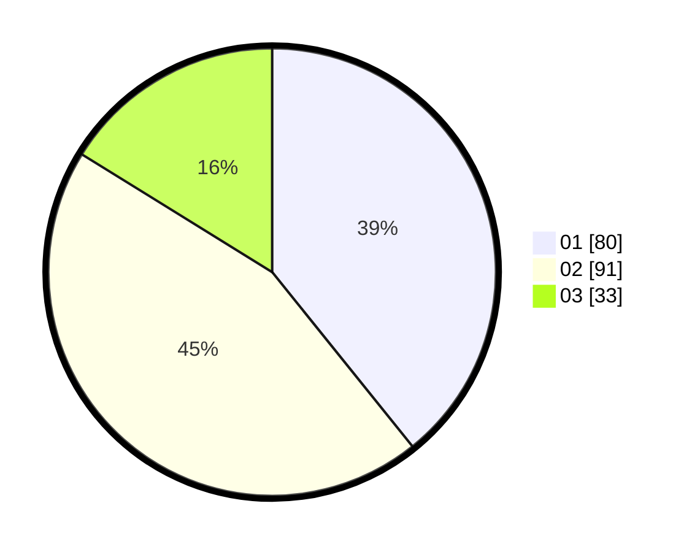

# Hasil

Hasil perolehan suara paslon dapat dilihat pada file paslon-01.txt, paslon-02.txt, dan paslon-03.txt.

Jika tidak ada, artinya data tersebut belum ada pada SIREKAP.

## Perolehan Suara

 * Paslon 01: **80**.
 * Paslon 02: **91**.
 * Paslon 03: **33**.

## Foto C Plano

https://sirekap-obj-formc.kpu.go.id/5ab2/pemilu/ppwp/31/74/05/10/06/3174051006086-20240215-180326--b38bf1eb-17ac-4996-890e-42d5d4b6cdd2.jpg

https://sirekap-obj-formc.kpu.go.id/5ab2/pemilu/ppwp/31/74/05/10/06/3174051006086-20240215-180436--a241e709-6df0-415d-bb5b-8870ce36d1ba.jpg

https://sirekap-obj-formc.kpu.go.id/5ab2/pemilu/ppwp/31/74/05/10/06/3174051006086-20240215-180636--0f8ade95-dc17-45b0-9909-ee6dc4dea3bc.jpg

## DATA PEMILIH TETAP

Jumlah pemilih dalam DPT: **295**.
 * L: **151**.
 * P: **144**.

## DATA PENGGUNA HAK PILIH

Jumlah pengguna hak pilih dalam DPT: **209**.
 * L: **98**.
 * P: **111**.

Jumlah pengguna hak pilih dalam DPTb: **0**.
 * L: **0**.
 * P: **0**.

Jumlah pengguna hak pilih dalam DPK: **0**.
 * L: **0**.
 * P: **0**.

Jumlah pengguna hak pilih: **209**.
 * L: **98**.
 * P: **111**.

## JUMLAH SUARA SAH DAN TIDAK SAH

JUMLAH SELURUH SUARA SAH: **204**.

JUMLAH SUARA TIDAK SAH: **5**.

JUMLAH SELURUH SUARA SAH DAN SUARA TIDAK SAH: **209**.
