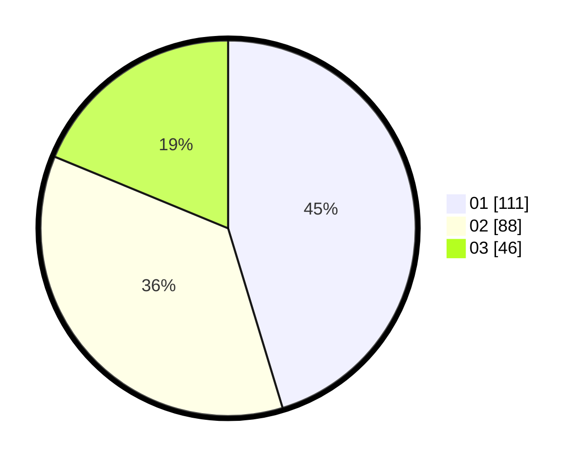

# Hasil

Hasil perolehan suara paslon dapat dilihat pada file paslon-01.txt, paslon-02.txt, dan paslon-03.txt.

Jika tidak ada, artinya data tersebut belum ada pada SIREKAP.

## Perolehan Suara

 * Paslon 01: **111**.
 * Paslon 02: **88**.
 * Paslon 03: **46**.

## Foto C Plano

https://sirekap-obj-formc.kpu.go.id/6a60/pemilu/ppwp/31/74/05/10/06/3174051006095-20240214-211144--fe2970a5-1118-472f-9b25-cacffaf2e8d1.jpg

https://sirekap-obj-formc.kpu.go.id/6a60/pemilu/ppwp/31/74/05/10/06/3174051006095-20240214-211317--1f47716d-3e76-4903-9a78-5558ec9f0341.jpg

https://sirekap-obj-formc.kpu.go.id/6a60/pemilu/ppwp/31/74/05/10/06/3174051006095-20240214-211454--ceb4c96f-fd9d-4206-8278-1f3f8cb610cb.jpg

## DATA PEMILIH TETAP

Jumlah pemilih dalam DPT: **294**.
 * L: **145**.
 * P: **149**.

## DATA PENGGUNA HAK PILIH

Jumlah pengguna hak pilih dalam DPT: **239**.
 * L: **112**.
 * P: **127**.

Jumlah pengguna hak pilih dalam DPTb: **5**.
 * L: **2**.
 * P: **3**.

Jumlah pengguna hak pilih dalam DPK: **2**.
 * L: **2**.
 * P: **0**.

Jumlah pengguna hak pilih: **246**.
 * L: **116**.
 * P: **130**.

## JUMLAH SUARA SAH DAN TIDAK SAH

JUMLAH SELURUH SUARA SAH: **245**.

JUMLAH SUARA TIDAK SAH: **1**.

JUMLAH SELURUH SUARA SAH DAN SUARA TIDAK SAH: **246**.
