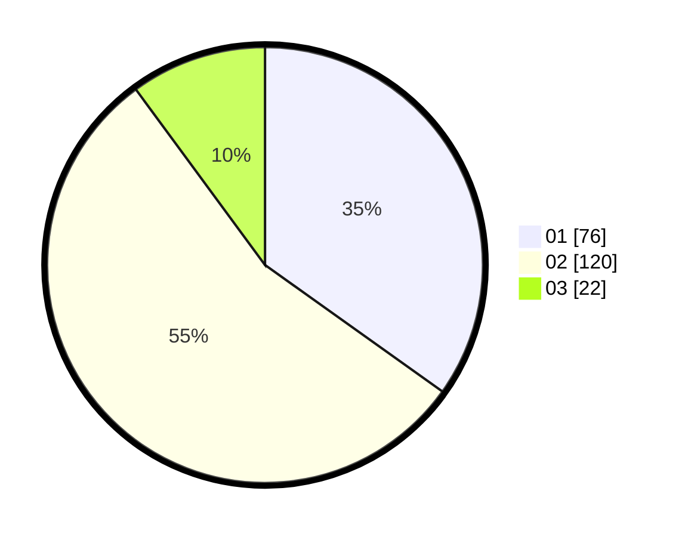

# Hasil

Hasil perolehan suara paslon dapat dilihat pada file paslon-01.txt, paslon-02.txt, dan paslon-03.txt.

Jika tidak ada, artinya data tersebut belum ada pada SIREKAP.

## Perolehan Suara

 * Paslon 01: **76**.
 * Paslon 02: **120**.
 * Paslon 03: **22**.

## Foto C Plano

https://sirekap-obj-formc.kpu.go.id/ea93/pemilu/ppwp/31/74/05/10/06/3174051006096-20240214-221412--5f93d78e-12bd-4bf3-b250-ef97dfcea87d.jpg

https://sirekap-obj-formc.kpu.go.id/ea93/pemilu/ppwp/31/74/05/10/06/3174051006096-20240214-215309--d3582c80-912d-4cb5-99e9-0697fdc4abde.jpg

https://sirekap-obj-formc.kpu.go.id/ea93/pemilu/ppwp/31/74/05/10/06/3174051006096-20240214-215735--da983e08-ef19-4300-87e0-aee3d24ed6cf.jpg
