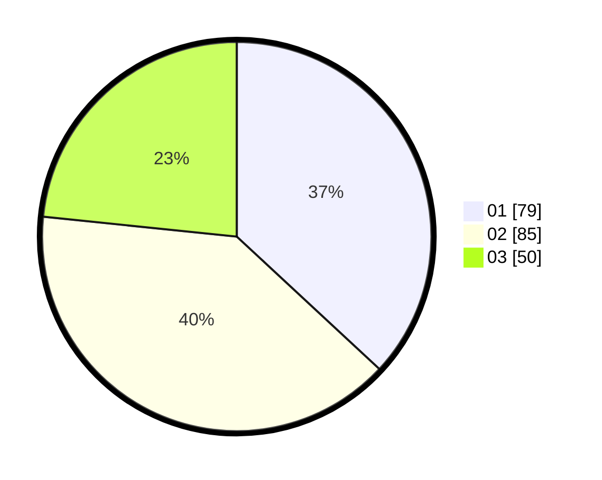

# Hasil

Hasil perolehan suara paslon dapat dilihat pada file paslon-01.txt, paslon-02.txt, dan paslon-03.txt.

Jika tidak ada, artinya data tersebut belum ada pada SIREKAP.

## Perolehan Suara

 * Paslon 01: **79**.
 * Paslon 02: **85**.
 * Paslon 03: **50**.

## Foto C Plano

https://sirekap-obj-formc.kpu.go.id/6c80/pemilu/ppwp/31/74/05/10/06/3174051006127-20240215-230159--c89457e9-f0ae-4cad-b548-e7ebade47e61.jpg

https://sirekap-obj-formc.kpu.go.id/6c80/pemilu/ppwp/31/74/05/10/06/3174051006127-20240215-230201--489cb703-afa6-4d2e-a75e-adcb8f773325.jpg

https://sirekap-obj-formc.kpu.go.id/6c80/pemilu/ppwp/31/74/05/10/06/3174051006127-20240215-230200--fbe62f7b-cd14-4fcd-b077-40477ae925c4.jpg

## DATA PEMILIH TETAP

Jumlah pemilih dalam DPT: **270**.
 * L: **133**.
 * P: **137**.

## DATA PENGGUNA HAK PILIH

Jumlah pengguna hak pilih dalam DPT: **208**.
 * L: **99**.
 * P: **109**.

Jumlah pengguna hak pilih dalam DPTb: **6**.
 * L: **2**.
 * P: **4**.

Jumlah pengguna hak pilih dalam DPK: **1**.
 * L: **0**.
 * P: **1**.

Jumlah pengguna hak pilih: **215**.
 * L: **101**.
 * P: **114**.

## JUMLAH SUARA SAH DAN TIDAK SAH

JUMLAH SELURUH SUARA SAH: **214**.

JUMLAH SUARA TIDAK SAH: **1**.

JUMLAH SELURUH SUARA SAH DAN SUARA TIDAK SAH: **215**.
