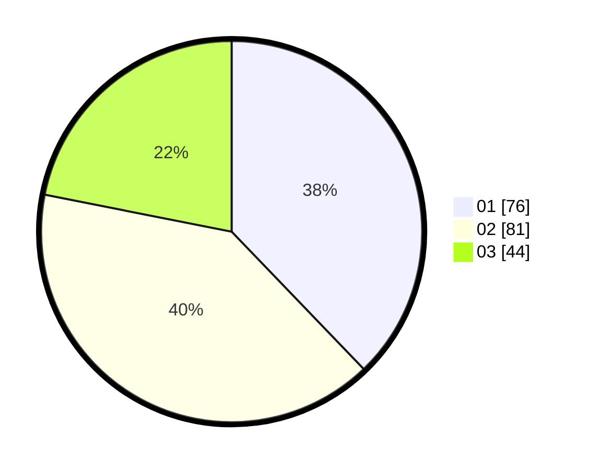

# Hasil

Hasil perolehan suara paslon dapat dilihat pada file paslon-01.txt, paslon-02.txt, dan paslon-03.txt.

Jika tidak ada, artinya data tersebut belum ada pada SIREKAP.

## Perolehan Suara

 * Paslon 01: **76**.
 * Paslon 02: **81**.
 * Paslon 03: **44**.

## Foto C Plano

https://sirekap-obj-formc.kpu.go.id/f7f1/pemilu/ppwp/31/74/05/10/06/3174051006132-20240214-221526--f446f723-692e-4ad4-8412-069fc5a9a211.jpg

https://sirekap-obj-formc.kpu.go.id/f7f1/pemilu/ppwp/31/74/05/10/06/3174051006132-20240214-221548--79da3b74-71a0-4d74-8565-fa94d7ec0ded.jpg

https://sirekap-obj-formc.kpu.go.id/f7f1/pemilu/ppwp/31/74/05/10/06/3174051006132-20240214-221610--ca934162-72ab-4715-9ae8-817ec2743256.jpg

## DATA PEMILIH TETAP

Jumlah pemilih dalam DPT: **250**.
 * L: **132**.
 * P: **118**.

## DATA PENGGUNA HAK PILIH

Jumlah pengguna hak pilih dalam DPT: **203**.
 * L: **101**.
 * P: **102**.

Jumlah pengguna hak pilih dalam DPTb: **1**.
 * L: **1**.
 * P: **0**.

Jumlah pengguna hak pilih dalam DPK: **1**.
 * L: **0**.
 * P: **1**.

Jumlah pengguna hak pilih: **205**.
 * L: **102**.
 * P: **103**.

## JUMLAH SUARA SAH DAN TIDAK SAH

JUMLAH SELURUH SUARA SAH: **201**.

JUMLAH SUARA TIDAK SAH: **4**.

JUMLAH SELURUH SUARA SAH DAN SUARA TIDAK SAH: **205**.
