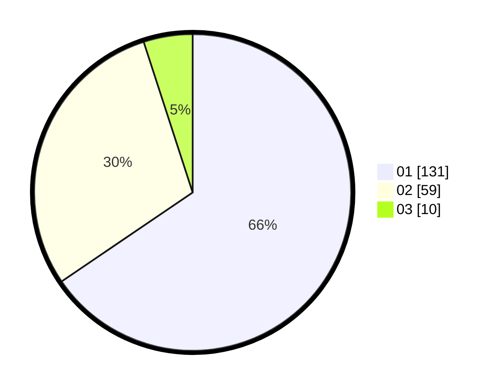

# Hasil

Hasil perolehan suara paslon dapat dilihat pada file paslon-01.txt, paslon-02.txt, dan paslon-03.txt.

Jika tidak ada, artinya data tersebut belum ada pada SIREKAP.

## Perolehan Suara

 * Paslon 01: **131**.
 * Paslon 02: **59**.
 * Paslon 03: **10**.

## Foto C Plano

https://sirekap-obj-formc.kpu.go.id/b927/pemilu/ppwp/31/74/06/10/01/3174061001002-20240214-184551--da05ecb4-6235-4325-97b1-317a3e73b13f.jpg

https://sirekap-obj-formc.kpu.go.id/b927/pemilu/ppwp/31/74/06/10/01/3174061001002-20240214-184456--752077c0-e610-40a4-a3cc-e25c8a28ca02.jpg

https://sirekap-obj-formc.kpu.go.id/b927/pemilu/ppwp/31/74/06/10/01/3174061001002-20240214-184831--af424d0c-8ecf-4aef-ac43-5013875c23e9.jpg

## DATA PEMILIH TETAP

Jumlah pemilih dalam DPT: **262**.
 * L: **132**.
 * P: **130**.

## DATA PENGGUNA HAK PILIH

Jumlah pengguna hak pilih dalam DPT: **198**.
 * L: **96**.
 * P: **102**.

Jumlah pengguna hak pilih dalam DPTb: **3**.
 * L: **1**.
 * P: **2**.

Jumlah pengguna hak pilih dalam DPK: **2**.
 * L: **1**.
 * P: **1**.

Jumlah pengguna hak pilih: **203**.
 * L: **98**.
 * P: **105**.

## JUMLAH SUARA SAH DAN TIDAK SAH

JUMLAH SELURUH SUARA SAH: **200**.

JUMLAH SUARA TIDAK SAH: **3**.

JUMLAH SELURUH SUARA SAH DAN SUARA TIDAK SAH: **203**.
