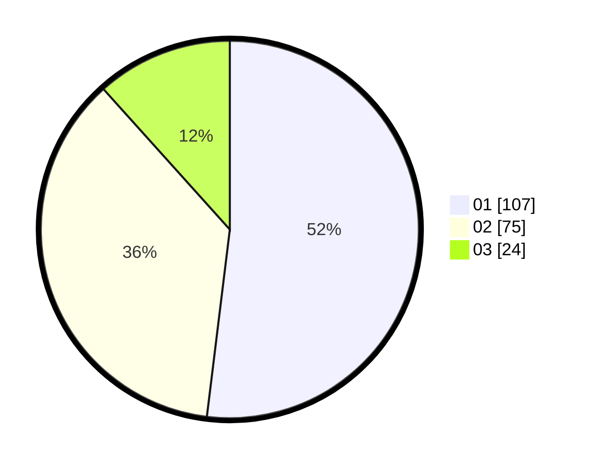

# Hasil

Hasil perolehan suara paslon dapat dilihat pada file paslon-01.txt, paslon-02.txt, dan paslon-03.txt.

Jika tidak ada, artinya data tersebut belum ada pada SIREKAP.

## Perolehan Suara

 * Paslon 01: **107**.
 * Paslon 02: **75**.
 * Paslon 03: **24**.

## Foto C Plano

https://sirekap-obj-formc.kpu.go.id/01ab/pemilu/ppwp/31/74/06/10/01/3174061001003-20240216-151629--a560c10b-6fa7-43df-9d12-13fae7fa6ed2.jpg

https://sirekap-obj-formc.kpu.go.id/01ab/pemilu/ppwp/31/74/06/10/01/3174061001003-20240216-151957--641fdde2-1e9e-4353-ab5e-925c1a97cd22.jpg

https://sirekap-obj-formc.kpu.go.id/01ab/pemilu/ppwp/31/74/06/10/01/3174061001003-20240216-152047--185e0a91-26b2-4fb4-8edb-d605ea18180d.jpg
