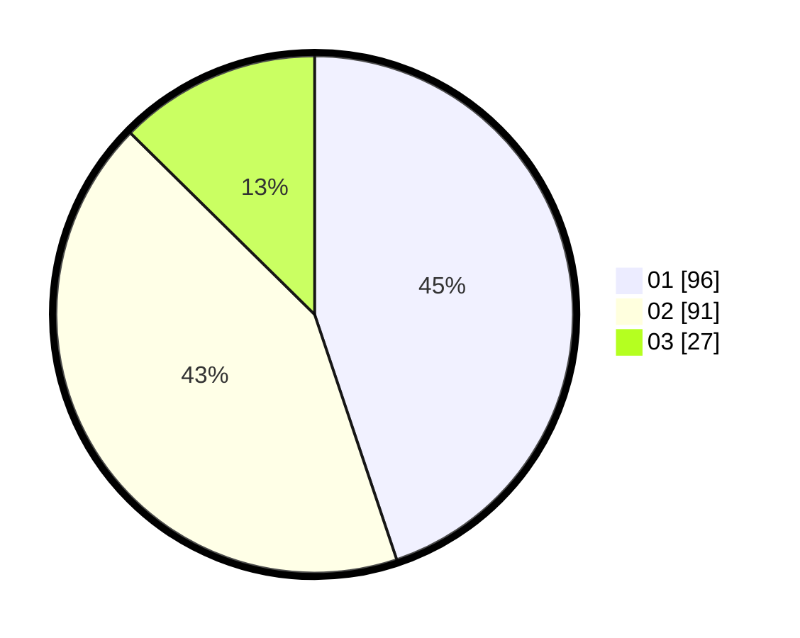

# Hasil

Hasil perolehan suara paslon dapat dilihat pada file paslon-01.txt, paslon-02.txt, dan paslon-03.txt.

Jika tidak ada, artinya data tersebut belum ada pada SIREKAP.

## Perolehan Suara

 * Paslon 01: **96**.
 * Paslon 02: **91**.
 * Paslon 03: **27**.

## Foto C Plano

https://sirekap-obj-formc.kpu.go.id/e266/pemilu/ppwp/31/74/06/10/01/3174061001004-20240216-153813--7c0228b1-4fd9-4c34-a4cd-ff1b6b3ef0c1.jpg

https://sirekap-obj-formc.kpu.go.id/e266/pemilu/ppwp/31/74/06/10/01/3174061001004-20240216-154327--d703412e-b31a-45c8-9040-226151ba6f1d.jpg

https://sirekap-obj-formc.kpu.go.id/e266/pemilu/ppwp/31/74/06/10/01/3174061001004-20240216-154532--7fe303a1-3d72-48d0-99ba-8823f4b7689c.jpg
